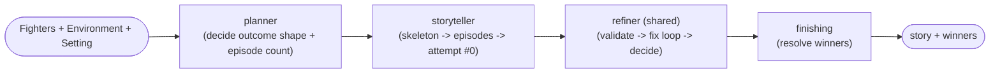
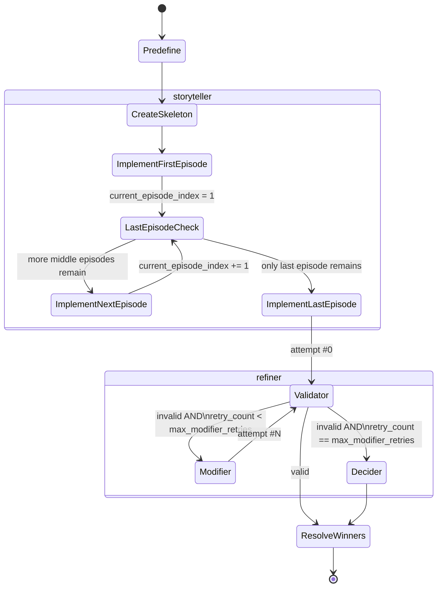

# Graph: Battle

## 1. Purpose & Scope

The `battle` graph produces the narrative fight story for `/quick-battle` and determines its winner(s). It runs inside `AI Worker`, invoked as its own `ai_task`, receiving the finished `Environment` from the `environment` graph as one of its inputs rather than ever nesting inside it (confirmed, `graphs/environment.md` §1).

Unlike `environment`, `battle` has **no branching entry modes** — every invocation follows the same shape: plan → write → refine → resolve winners. There is no `initial`/`revision` distinction here; a battle is generated once per lobby.

To improve length and quality over a single massive generation call, the story is written **episode by episode** from a pre-planned skeleton, then validated and fixed as a whole (not per-episode) — mirroring `environment`'s `Validator ↔ Enhancer` loop, now formalized as the shared `refiner` pattern in `ai_worker/nodes.md`.

---

## 2. Invocation Contract

**Input State:**

| Field | Type | Required | Description |
|---|---|---|---|
| `fighters` | `list[Fighter]` (§5) | Yes | `1..10` unique participants. Carries exact Discord `player_id` and Bot-side display snapshot `player_nick`; both are retained on the wire for Bot winner rendering, but `player_nick` is excluded from every LLM prompt and `player_id` is excluded except the structured emergent winner-resolution identity map. A solo fighter is valid and may either survive (`outcome_type="one"`) or die/no victor (`"none"`); no winner is assumed. |
| `environment` | `Environment` (per `graphs/environment.md` §5) | Yes | The finished arena from the `environment` graph. `battle` never generates or modifies it. |
| `setting` | `str` (enum) | Yes | Same target `prompts/elements/setting/<name>.txt` values as `environment` (§2 there). Directs narrative tone/rules. |
| `language_locale` | `str` | Yes | Same as `environment`: value **after** Bot's UI→AI mapping (`contracts/localization.md` §4), e.g. `uk-UA` for stored `ua`. Injected via `prompts/elements/language.txt`. |
| `random_winner_mode` | `bool` | Yes | If `true`, `Predefine` commits to winner(s); if `false`, winners emerge and `ResolveWinners` resolves exact IDs. `/quick-battle` always supplies `false` in v1. Future exposure/source is P2 and does not affect this graph contract. |
| `max_modifier_retries` | `int` | No — defaults to `BATTLE_MAX_MODIFIER_RETRIES` (§8) | `0..3`; callers may lower but never raise the v1 cap. |
| `trace_id`, `guild_id` | `str` | Yes | Correlation metadata for logging. |
| `api_key`, `model` | `str` | Yes | **Added this revision** — same per-guild Gemini credential/model pair as `graphs/environment.md` §2, attached by `Bot` when publishing the `ai_tasks` message (`ai_worker.md` §1/§4). Never logged (`ai_worker.md` §7). |

**Output State:**

| Field | Type | Description |
|---|---|---|
| `story` | `str` | The full, finished battle narrative — either `Validator`-approved or `Decider`'s pick. |
| `winners` | `list[str]` | Real Discord `player_id`s of the victor(s). Empty list if `outcome_type == "none"`. |
| `attempts_used` | `int` | Total recorded story candidates, exactly `len(attempts)` (`1..4`), including attempt #0. |
| `forced_selection` | `bool` | `true` if no candidate ever passed `Validator` and `Decider` had to choose among imperfect attempts. |

---

## 3. Graph Structure

Four phases (one more than `environment`, since planning and multi-episode composition are each substantial enough to separate):

1. **`planner`** — a single node, `Predefine`. Decides the outcome's *shape* (`outcome_type`, `episode_count`), and — only in `random_winner_mode` — the specific winner(s) too.
2. **`storyteller`** — builds the first full draft (`attempt #0`) episode by episode: `CreateSkeleton` → `ImplementFirstEpisode` → (loop) `ImplementNextEpisode` → `ImplementLastEpisode`.
3. **`refiner`** — the shared pattern from `ai_worker/nodes.md`: `Validator` ↔ `Modifier` (this graph's "fixer" node) loop, bounded by `max_modifier_retries`, falling back to the shared `Decider` on exhaustion.
4. **`finishing`** — `ResolveWinners`, producing the final `winners` list from whichever story `refiner` settled on.

`Validator` and `Decider` are **shared code** (`ai_worker/nodes/validation.py`, `ai_worker/nodes/decider.py`) — see `ai_worker/nodes.md`. `Modifier` is this graph's own "fixer" node, applying fixes to prose only (confirmed — see §7's note on why the skeleton is never revised after `CreateSkeleton`).

> **Confirmed decision — minimum 2 episodes:** `Predefine` must never emit `episode_count < 2`. At exactly 2, the `ImplementNextEpisode` loop is skipped entirely (`ImplementFirstEpisode` → straight to `ImplementLastEpisode`) — there is no combined "first-is-also-last" node; the diagram's ambiguity at 1 episode is resolved by disallowing it outright.

---

## 4. Graph Diagram

**Phase-level overview:**



**Detailed state diagram:**



At `episode_count == 2` (the confirmed minimum, §3), `LastEpisodeCheck` is immediately true right after `ImplementFirstEpisode` — the `ImplementNextEpisode` edge is simply never taken for that run, not a special-cased path.

---

## 5. State Schema (Internal)

`ModificationRequest`, `ValidatorVerdict`, and `AttemptRecord` come from the shared `refiner` contract in `ai_worker/nodes.md` §1 — not redefined here. This graph's `AttemptRecord.candidate` is the story `str`; `source` is `"initial"` for attempt #0 (`ImplementLastEpisode`'s output) and `"fixer"` for every `Modifier`-driven retry.

```python
class Fighter(TypedDict):
    """Both identity fields are always present. player_id is the only winner identity;
    player_nick is a Bot-side display snapshot and is never fuzzy-matched or sent to an LLM."""
    player_id: str        # real Discord user ID — ground truth, never guessed/fuzzy-matched after the fact
    player_nick: str       # Bot-side winner rendering/mention fallback only; excluded from all LLM prompts
    fighter_name: str
    description: str
    strategy: str | None

class EpisodeSkeleton(TypedDict):
    episode_index: int
    summary: str           # short beat, e.g. "Fighter A ambushes Fighter B; a passage to hell opens"

class BattleGraphState(TypedDict):
    # --- Input contract (§2) ---
    fighters: list[Fighter]
    environment: "Environment"     # from ai_worker/graphs/environment.md §5
    setting: str
    language_locale: str
    random_winner_mode: bool
    max_modifier_retries: int
    trace_id: str
    guild_id: str
    api_key: str                  # per-guild Gemini credential, added this revision — see §2
    model: str                    # per-guild Gemini model, added this revision — see §2

    # --- planner phase ---
    outcome_type: Literal["none", "one", "multiple"]
    episode_count: int              # enforced >= 2, see §3
    predetermined_winners: list[str] | None   # set only if random_winner_mode is True

    # --- storyteller phase ---
    skeleton: list[EpisodeSkeleton]
    episode_texts: list[str]        # implemented prose, in order, appended as each episode completes
    current_episode_index: int

    # --- refiner phase (shared types, ai_worker/nodes.md §1) ---
    active_request: ModificationRequest | None
    current_story: str              # episode_texts joined; what Validator/Modifier operate on
    attempts: list[AttemptRecord]
    retry_count: int

    # --- finishing phase / output contract (§2) ---
    story: str
    winners: list[str]
    attempts_used: int
    forced_selection: bool
```

`predetermined_winners` vs the final `winners` output deliberately stay separate fields: in `random_winner_mode`, `ResolveWinners` just carries `predetermined_winners` forward (§6); in emergent mode, `predetermined_winners` stays `None` for the entire run and `winners` is populated for the first time at `ResolveWinners`.

Input bounds: `fighters` has `1..10` entries with unique decimal-string `player_id`; `player_nick` and `fighter_name` are trimmed `1..80` characters; `description` is `1..1,000`; optional `strategy` is `1..500` when present. Control characters are rejected. `environment` must satisfy `environment.md` §5.

### 5a. Exact LLM structured outputs

```python
class PredefineOutput(TypedDict):
    outcome_type: Literal["none", "one", "multiple"]
    episode_count: int                         # 2..5
    predetermined_winners: list[str] | None    # exact player_ids

class SkeletonOutput(TypedDict):
    episodes: list[EpisodeSkeleton]            # exact episode_count, contiguous 0-based indices

class EpisodeOutput(TypedDict):
    episode_index: int                         # exact requested index
    text: str                                  # 1..3,500 chars

class StoryOutput(TypedDict):
    story: str                                 # 1..12,000 chars

class WinnerResolution(TypedDict):
    winner_ids: list[str]                      # exact input player_ids only
```

| Node | Structured output |
|---|---|
| `Predefine` | `PredefineOutput` |
| `CreateSkeleton` | `SkeletonOutput`; each summary `1..500` chars |
| `ImplementFirstEpisode` / `ImplementNextEpisode` / `ImplementLastEpisode` | `EpisodeOutput` |
| `Validator` | Shared `ValidatorVerdict` with the battle rubric (`nodes.md` §2a) |
| `Modifier` | `StoryOutput` |
| `Decider` | Shared `DeciderSelection` (`nodes.md` §3) |
| `ResolveWinners` | `WinnerResolution` in emergent mode; no LLM call in scripted mode |

Outcome cardinality is exact: `none` requires zero winners; `one` exactly one; `multiple` requires `2..len(fighters)` and is invalid for a solo fighter. In emergent mode `predetermined_winners` must be `null`; in scripted mode it must contain unique exact input IDs matching cardinality. `Predefine` values outside these rules are malformed structured output: use the shared retry budget, then fail at `Predefine`; never clamp episode count or repair IDs.

The strict parser/coercion policy is `nodes.md` §1a. Final joined story length is checked after every episode append and Modifier output.

---

## 6. Nodes

| Node | Phase | Responsibility | Reads | Writes | LLM call | Prompt file(s) | Location |
|---|---|---|---|---|---|---|---|
| `Predefine` | `planner` | Decides `outcome_type` + `episode_count` (enforced `>= 2`). In `random_winner_mode`, selects deterministic neutral fighter labels which the worker maps to `predetermined_winners` IDs internally. | Safe fighter context (`fighter_name`, description, optional strategy, neutral labels), `environment`, `setting`, `random_winner_mode` | `outcome_type`, `episode_count`, `predetermined_winners` | Yes | `ai_worker/prompts.md` §4.2 — `graphs/battle/predefine.txt` | `graphs/battle/nodes/predefine.py` |
| `CreateSkeleton` | `storyteller` | Plans per-episode beats across `episode_count` episodes, consistent with `outcome_type` (and `predetermined_winners`, if set). | `outcome_type`, `episode_count`, `predetermined_winners`, `fighters`, `environment`, `setting` | `skeleton` | Yes | `ai_worker/prompts.md` §4.2 — `graphs/battle/create_skeleton.txt` | `graphs/battle/nodes/create_skeleton.py` |
| `ImplementFirstEpisode` | `storyteller` | Writes the first episode's prose — deliberately the largest/most detailed alongside the last (project owner's flow), potentially its own prompt. | `skeleton[0]`, `fighters`, `environment`, `setting`, `language_locale` | `episode_texts[0]`, `current_episode_index = 1` | Yes | `ai_worker/prompts.md` §4.2 — `graphs/battle/implement_first_episode.txt` | `graphs/battle/nodes/implement_first_episode.py` |
| `ImplementNextEpisode` | `storyteller` (loop) | Writes a middle episode's prose from its skeleton beat plus prior episode text. Skipped entirely when `episode_count == 2` (§3). | `skeleton[i]`, `episode_texts[:i]`, `fighters`, `environment`, `setting`, `language_locale` | `episode_texts[i]`, `current_episode_index += 1` | Yes | `ai_worker/prompts.md` §4.2 — `graphs/battle/implement_next_episode.txt` | `graphs/battle/nodes/implement_next_episode.py` |
| `ImplementLastEpisode` | `storyteller` | Writes the final episode, resolving the battle per the skeleton; also the largest/most detailed. Produces attempt #0. | `skeleton[-1]`, `episode_texts`, `fighters`, `environment`, `setting`, `language_locale`, `predetermined_winners`? | `episode_texts[-1]`, `current_story`, `attempts[0]` | Yes | `ai_worker/prompts.md` §4.2, §6 — `graphs/battle/implement_last_episode.txt`; legacy `core_simple_battle.txt` is reference-only | `graphs/battle/nodes/implement_last_episode.py` |
| `Validator` | `refiner` (shared) | Judges `current_story` against `setting`, `outcome_type`, fighter/environment consistency, and scripted winner IDs when present. | `current_story`, `setting`, `outcome_type`, `fighters`, `environment`, `predetermined_winners` | `attempts[-1].validator_verdict`, `active_request` (on failure) | Yes | `ai_worker/prompts.md` §4.2, §5 — `nodes/validator_base.txt` (shared) + `graphs/battle/validator_criteria.txt` | `ai_worker/nodes/validation.py` — shared with `environment`, see `ai_worker/nodes.md` §2 |
| `Modifier` | `refiner` | Applies `active_request` to `current_story`. **Prose-only** (confirmed decision) — never revises `skeleton`; if an issue genuinely requires restructuring episodes, that's out of scope for v1 (§7, §12). | `current_story`, `active_request`, `setting`, `language_locale` | `current_story`, appends `AttemptRecord` | Yes | `ai_worker/prompts.md` §4.2 — `graphs/battle/modifier.txt` | `graphs/battle/nodes/modifier.py` (graph-specific "fixer," per `ai_worker/nodes.md` §4) |
| `Decider` | `refiner` (fallback, shared) | Reached when `retry_count == max_modifier_retries` and still invalid. Picks the best of all attempts, including #0, using the same identity/outcome context as Validator. | `attempts` (full history), `fighters`, `environment`, `outcome_type`, `predetermined_winners` | `story` (candidate), `forced_selection = true` | Yes | `ai_worker/prompts.md` §4.2, §5 — `nodes/decider_base.txt` (shared) + `graphs/battle/decider_criteria.txt` | `ai_worker/nodes/decider.py` — shared with `environment`, see `ai_worker/nodes.md` §3 |
| `ResolveWinners` | `finishing` | Produces `winners: list[player_id]`. **Scripted mode:** validated passthrough of `predetermined_winners`, no LLM call. **Emergent mode:** structured `WinnerResolution` receives a narrow fighter-name/neutral-label → exact-ID map and returns supplied IDs only. `player_nick` is excluded from all LLM prompts. Invalid IDs/cardinality retry, then fail closed. | `story`, fighter-name context plus the emergent-only ID map, `predetermined_winners`, `random_winner_mode`, `outcome_type` | `winners` | Conditional — no in scripted mode, yes in emergent mode | `ai_worker/prompts.md` §4.2 — `graphs/battle/resolve_winners.txt` (prompt prose authored in Phase 4) | `graphs/battle/nodes/resolve_winners.py` |

> **Prompt inventory note:** the target prompt files under `prompts/graphs/battle/` are authored and used at runtime. `prompts/core/core_simple_battle.txt` remains a legacy reference only and is not a runtime graph input.

---

## 7. Control Flow: Routing & Loop Termination

- **Entry:** unconditional — every invocation starts at `Predefine`. Unlike `environment`, there is no input-type branch (§1).
- **Episode loop:** after `ImplementFirstEpisode`, `LastEpisodeCheck` compares `current_episode_index` against `episode_count - 1`. While more middle episodes remain, loop through `ImplementNextEpisode`; once only the last one remains, break to `ImplementLastEpisode`. At the enforced minimum `episode_count == 2` (§3), this check is immediately true right after the first episode.
- **Refiner loop:** `Validator ↔ Modifier`, bounded by `max_modifier_retries` (default `3`, §8) — structurally identical to `environment`'s loop, per the shared pattern in `ai_worker/nodes.md` §4.
- **Exit conditions (mutually exclusive):**
  1. `Validator` finds `current_story` valid → `ResolveWinners` → graph ends, `forced_selection = false`.
  2. `retry_count` reaches `max_modifier_retries`, still invalid → `Decider` → `ResolveWinners` → graph ends, `forced_selection = true`.
- **`Modifier` never touches `skeleton`** (confirmed decision) — every fix is a prose-level edit to `current_story`, exactly mirroring `environment`'s `Enhancer` never re-deriving from scratch. If this proves insufficient in practice (an issue that genuinely requires re-planning episode structure), that's a v2 concern, not handled here — see §12.
- **`ResolveWinners` always runs once, after `refiner` concludes** — regardless of which exit path was taken, and regardless of `random_winner_mode`. It is not part of the `refiner` loop itself.
- **Winner validation is fail-closed.** Scripted mode uses only previously validated predetermined IDs. Emergent mode rejects the entire structured result if any ID is unknown/duplicated or cardinality disagrees with `outcome_type`; after shared retries, the task fails at `ResolveWinners`. Never filter partially, fuzzy-match, randomly choose, or convert an invalid non-`none` outcome to no winner.
- **Validator enforces scripted consistency** whenever `random_winner_mode=true`: the narrated victor(s) must equal `predetermined_winners`. `/quick-battle` remains emergent-only in v1, but the graph contract is valid for both modes.
- **Scripted narrative consistency is semantic rubric work.** `Validator` and `Decider` receive predetermined neutral fighter labels, never Discord IDs or nicknames, and judge whether prose honors them. Because story candidates are prose strings, this is not a deterministic postcondition and no nickname matching is performed. `ResolveWinners` remains the deterministic scripted-mode passthrough after `Predefine` has mapped validated labels to IDs and checked cardinality.

---

## 8. Configuration / Tunable Parameters

| Name | Default | Description |
|---|---|---|
| `BATTLE_MIN_EPISODES` | `2` | Floor enforced on `Predefine`'s `episode_count` output (§3). Not exposed as a graph input — this is a hard structural constraint on the graph itself, not something a caller should override per-call. |
| `BATTLE_MAX_EPISODES` | `5` | Hard ceiling on `Predefine`; values outside `2..5` are malformed, not clamped. |
| `BATTLE_MAX_MODIFIER_RETRIES` | `3` | Ceiling on `Validator`-driven retries before falling back to `Decider`. Exposed as the graph input `max_modifier_retries` (§2). Independent budget from `ENVIRONMENT_MAX_ENHANCER_RETRIES` — see `ai_worker/nodes.md` §4. |
| `BATTLE_TASK_DEADLINE_SEC` | `840` | Hard worker-side wall-clock deadline from graph invocation through winner resolution. |
| `BATTLE_MAX_INPUT_TOKENS` | `350000` | Cumulative input-token ceiling across all Gemini calls and retries. |
| `BATTLE_MAX_OUTPUT_TOKENS` | `90000` | Cumulative output-token ceiling across all Gemini calls and retries. |

> These variables are graph-specific and belong in this doc. The graph-agnostic `AI_WORKER_LLM_MAX_RETRIES` remains defined once in `ai_worker.md` §3.

### 8a. Per-node Gemini output limits

These are hard `max_output_tokens` values supplied to Gemini for every API attempt, including retries:

| Node | Maximum output tokens |
|---|---:|
| `Predefine` | `1024` |
| `CreateSkeleton` | `4096` |
| `ImplementFirstEpisode` | `4096` |
| `ImplementNextEpisode` | `4096` |
| `ImplementLastEpisode` | `4096` |
| `Validator` | `2048` |
| `Modifier` | `16384` |
| `Decider` | `1024` |
| `ResolveWinners` (emergent mode only) | `1024` |

All three episode-writing nodes deliberately share the same `4096` limit because they return the same bounded `EpisodeOutput` schema (`text` ≤3,500 characters). `Modifier` receives the larger `16384` limit because it may return the complete `StoryOutput` (`story` ≤12,000 characters). The planning, validation, selection, and winner-resolution nodes return substantially smaller bounded structures. These are implementation constants, not environment variables or caller overrides. Scripted-mode `ResolveWinners` makes no LLM call and consumes no token reservation.

At five episodes and three Modifier retries, the worst path is 16 logical LLM calls: `Predefine` + `CreateSkeleton` + 5 episode calls + 4 Validators + 3 Modifiers + `Decider` + emergent `ResolveWinners`. Before API retries, reserving every logical call at its per-node maximum totals `84,992` output tokens, so the complete maximum logical path fits under `BATTLE_MAX_OUTPUT_TOKENS=90,000`.

With two retries after each first attempt, the absolute cap is 48 API attempts, but retries consume the same cumulative budget and may terminate the task before that theoretical attempt cap. Across one `/quick-battle` with an initial environment plus three revisions, the combined maxima remain 55 logical calls / 165 API attempts before deadline/token cuts.

Gemini usage is accumulated after every API attempt. Before each attempt, the worker reserves that node's configured maximum output and fails before calling if the remaining output budget cannot cover it. The configured `max_output_tokens` prevents an individual response from exceeding its reservation.

The 30-second progress heartbeat runs independently while Gemini calls are pending, giving four heartbeat opportunities within the 120-second Bot stall window. `BATTLE_TASK_DEADLINE_SEC=840` leaves 60 seconds inside `BOT_AI_TASK_TIMEOUT_SEC=900` for dispatch/result handling. This remains sound because `contracts/ai_task.md` §5a permits only one outstanding AI task per Bot node; queued task latency is otherwise unbounded.

---

## 9. Failure Modes

| Failure | Detection | Recovery |
|---|---|---|
| Gemini API call fails/times out, or any LLM node returns structurally invalid output | Exception / schema validation error | Same shared `AI_WORKER_LLM_MAX_RETRIES` wrapper as `environment` — see `ai_worker/nodes.md` §5. Not redefined per-graph. |
| `Predefine` violates episode, outcome, or predetermined-winner rules | Structured validation immediately after `Predefine` | Same malformed-output retry budget as any LLM node; exhaustion fails the task at `Predefine`. No clamping/coercion. |
| `max_modifier_retries` reached with zero fully valid attempts | `retry_count == max_modifier_retries`, last verdict still invalid | Expected Decider path. It selects by the documented semantic rubric and may force-select imperfect prose; `ResolveWinners` still deterministically validates emergent IDs or passes through already-validated scripted IDs. No full re-plan from `Predefine`. |
| `ResolveWinners` returns unknown/duplicate IDs or wrong cardinality | Exact membership/cardinality validation | Retry structured output; exhaustion fails at `ResolveWinners`. No nickname fallback or partial filtering. |
| Scripted story contradicts `predetermined_winners` | Validator's required battle rubric | Invalid candidate; Modifier receives the fix request. Decider prioritizes outcome consistency if retries exhaust. |
| Graph deadline or cumulative token budget would be exceeded | Monotonic deadline / accumulated Gemini usage | Stop before the next call and publish `AiTaskResultFailed`; never deliver a partial story. |

---

## 10. Dependencies

| Dependency | Used by | Notes |
|---|---|---|
| `ai_worker/nodes.md` (shared contract doc) | `Validator`, `Decider`, this doc's state schema (§5) | Defines `ModificationRequest`/`ValidatorVerdict`/`AttemptRecord` once. |
| `ai_worker/nodes/validation.py` (shared) | `Validator` | Shared with `environment` — see `ai_worker/nodes.md` §2. |
| `ai_worker/nodes/decider.py` (shared) | `Decider` | Shared with `environment` — see `ai_worker/nodes.md` §3. |
| `graphs/environment.md` (its output) | `Predefine`, `CreateSkeleton`, all `Implement*Episode` nodes, `Validator` | This graph's `environment` input field is the `environment` graph's `final_environment` output — confirmed cross-graph relationship, see `graphs/environment.md` §1. |
| `ai_worker/prompts.md` (shared contract doc) | Every LLM node | Single source of truth for every prompt file this graph's nodes use, plus the injection pattern and the legacy `core_simple_battle.txt` migration note — see §6, §10's prompt inventory note. Replaces individually citing `prompts/setting/*.txt`, `prompts/elements/language.txt`, `prompts/elements/fighters.txt`, `prompts/elements/environment.txt` here. |
| `docs/contracts/localization.md` | Every LLM node consuming `language_locale` | Defines where `language_locale`'s value comes from — resolves the previously-open sourcing question, see §2. |
| Google Gemini API | Every node except `LastEpisodeCheck`'s routing logic and `ResolveWinners` in scripted mode | |
| `docs/contracts/task_progress.md` | All nodes (indirectly, via the Celery task wrapper) | This graph's phase mapping is now filled in at `task_progress.md` §6.1. |

---

## 11. Logging & Observability

- Same structured log format and tagging convention as `environment.md` §11: `[%time%][%level%][ai_worker][graphs/battle/nodes/<node>]<trace_id, guild_id, attempt_index>: [%message%]`.
- **Discord-facing task progress** (per `docs/contracts/task_progress.md`, now filled in for this graph): `composing` covers the entire `planner` + `storyteller` phases (`Predefine` through `ImplementLastEpisode`) — from a status-bar perspective, "still writing the story" is one bucket, not two. `refining` covers the `Validator ↔ Modifier` loop. `finishing` covers `Decider` (if reached) and `ResolveWinners`.
- `attempts_used` and `forced_selection` could support the same future quality analysis described in `environment.md` §11, but are explicitly deferred from v1 telemetry; do not emit them as ad hoc metrics (`ai_worker.md` §8).

---

## 12. Open Items / Future Work

- Prompt prose implements the already-fixed schemas/rubrics/bounds; it does not redefine them.
- ~~Whether `prompts/core/core_simple_battle.txt` gets adapted into `ImplementLastEpisode`'s prompt, split across multiple episode nodes, or fully replaced~~ — **narrowed, not fully resolved**: `ai_worker/prompts.md` §6 recommends treating it as a tone/logic *reference* for `ImplementFirstEpisode`/`ImplementLastEpisode` rather than a direct source for either (it predates the episode concept and covers the entire battle single-shot). The actual content still needs to be authored from that reference, not copied.
- `random_winner_mode` is hardcoded `false` by `/quick-battle` in v1. Future exposure/source remains P2 and does not block graph implementation.
- ResolveWinners identity validation/failure, scripted consistency, Validator/Decider rubrics, bounds, and scaling are resolved in §5a/§7/§8 and `nodes.md`.
- Whether `Modifier`'s prose-only restriction (§7) proves sufficient in practice, or whether some issues genuinely need skeleton-level revision, is a v2 concern not addressed here.
- Task handoff is resolved: each environment generation/revision and the final battle are separate expected `ai_task` values owned by the same Bot session (`bot/commands/quick-battle.md`).
