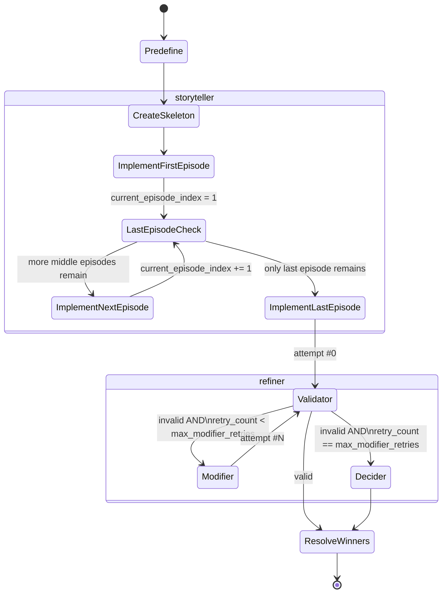

# Graph: Battle

## 1. Purpose & Scope

The `battle` graph produces the narrative fight story for `/quick-battle` and determines its winner(s). It runs inside `AI Worker`, invoked as its own `ai_task`, receiving the finished `Environment` from the `environment` graph as one of its inputs rather than ever nesting inside it (confirmed, `graphs/environment.md` §1).

Unlike `environment`, `battle` has **no branching entry modes** — every invocation follows the same shape: plan → write → refine → resolve winners. There is no `initial`/`revision` distinction here; a battle is generated once per lobby.

To improve length and quality over a single massive generation call, the story is written **episode by episode** from a pre-planned skeleton, then validated and fixed as a whole (not per-episode) — mirroring `environment`'s `Validator ↔ Enhancer` loop, now formalized as the shared `refiner` pattern in `ai_worker/nodes.md`.

---

## 2. Invocation Contract

**Input State:**

| Field | Type | Required | Description |
|---|---|---|---|
| `fighters` | `list[Fighter]` (§5) | Yes | One entry per participant. Carries both `player_id` (real Discord ID) and `player_nick` (display name used in prose) — see §5's design note on why both are needed. |
| `environment` | `Environment` (per `graphs/environment.md` §5) | Yes | The finished arena from the `environment` graph. `battle` never generates or modifies it. |
| `setting` | `str` (enum) | Yes | Same `prompts/setting/<name>.txt` values as `environment` — see `graphs/environment.md` §2. Directs narrative tone/rules per `prompts/core/core_simple_battle.txt`'s existing `{SETTING}` usage. |
| `language_locale` | `str` | Yes | Same mechanism as `environment` — `prompts/elements/language.txt`'s `{locale}` slot. **Sourcing resolved** — see `docs/contracts/localization.md`: guild-level value set via `/config`, currently shared with Bot UI localization. |
| `random_winner_mode` | `bool` | Yes | **Confirmed design fork (project owner):** if `true`, `Predefine` commits to specific winner(s) up front and the story is written to reach that outcome. If `false`, the winner emerges from the narrative and is resolved after the fact by `ResolveWinners` (§3, §6). **Origin of this flag (guild setting? host's per-lobby choice?) is undocumented** — flagged in §12, same shape of gap as `environment`'s `language_locale` origin. |
| `max_modifier_retries` | `int` | No — defaults to `BATTLE_MAX_MODIFIER_RETRIES` (§8) | Independent retry budget from `environment`'s — see `ai_worker/nodes.md` §4 on why these aren't shared. |
| `trace_id`, `guild_id` | `str` | Yes | Correlation metadata for logging. |
| `api_key`, `model` | `str` | Yes | **Added this revision** — same per-guild Gemini credential/model pair as `graphs/environment.md` §2, attached by `Bot` when publishing the `ai_tasks` message (`ai_worker.md` §1/§4). Never logged (`ai_worker.md` §7). |

**Output State:**

| Field | Type | Description |
|---|---|---|
| `story` | `str` | The full, finished battle narrative — either `Validator`-approved or `Decider`'s pick. |
| `winners` | `list[str]` | Real Discord `player_id`s of the victor(s). Empty list if `outcome_type == "none"`. |
| `attempts_used` | `int` | How many `Modifier` passes were needed, including the first pass. |
| `forced_selection` | `bool` | `true` if no candidate ever passed `Validator` and `Decider` had to choose among imperfect attempts. |

---

## 3. Graph Structure

Four phases (one more than `environment`, since planning and multi-episode composition are each substantial enough to separate):

1. **`planner`** — a single node, `Predefine`. Decides the outcome's *shape* (`outcome_type`, `episode_count`), and — only in `random_winner_mode` — the specific winner(s) too.
2. **`storyteller`** — builds the first full draft (`attempt #0`) episode by episode: `CreateSkeleton` → `ImplementFirstEpisode` → (loop) `ImplementNextEpisode` → `ImplementLastEpisode`.
3. **`refiner`** — the shared pattern from `ai_worker/nodes.md`: `Validator` ↔ `Modifier` (this graph's "fixer" node) loop, bounded by `max_modifier_retries`, falling back to the shared `Decider` on exhaustion.
4. **`finishing`** — `ResolveWinners`, producing the final `winners` list from whichever story `refiner` settled on.

`Validator` and `Decider` are **shared code** (`ai_worker/nodes/validation.py`, `ai_worker/nodes/decider.py`) — see `ai_worker/nodes.md`. `Modifier` is this graph's own "fixer" node, applying fixes to prose only (confirmed — see §7's note on why the skeleton is never revised after `CreateSkeleton`).

> **Confirmed decision — minimum 2 episodes:** `Predefine` must never emit `episode_count < 2`. At exactly 2, the `ImplementNextEpisode` loop is skipped entirely (`ImplementFirstEpisode` → straight to `ImplementLastEpisode`) — there is no combined "first-is-also-last" node; the diagram's ambiguity at 1 episode is resolved by disallowing it outright.

---

## 4. Graph Diagram

**Phase-level overview:**


**Detailed state diagram:**



At `episode_count == 2` (the confirmed minimum, §3), `LastEpisodeCheck` is immediately true right after `ImplementFirstEpisode` — the `ImplementNextEpisode` edge is simply never taken for that run, not a special-cased path.

---

## 5. State Schema (Internal)

`ModificationRequest`, `ValidatorVerdict`, and `AttemptRecord` come from the shared `refiner` contract in `ai_worker/nodes.md` §1 — not redefined here. This graph's `AttemptRecord.candidate` is the story `str`; `source` is `"initial"` for attempt #0 (`ImplementLastEpisode`'s output) and `"fixer"` for every `Modifier`-driven retry.

```python
class Fighter(TypedDict):
    """Confirmed design (project owner): both identity fields are always present.
    The LLM is given both and is responsible for mapping its own narrated player_nick
    back to the correct player_id when declaring winners — see ResolveWinners, §6."""
    player_id: str        # real Discord user ID — ground truth, never guessed/fuzzy-matched after the fact
    player_nick: str       # display name used in prose (prompts/elements/fighters.txt's `## FIGHTERS:` block)
    fighter_name: str
    description: str
    strategy: str | None

class EpisodeSkeleton(TypedDict):
    episode_index: int
    summary: str           # short beat, e.g. "Fighter A ambushes Fighter B; a passage to hell opens"

class BattleGraphState(TypedDict):
    # --- Input contract (§2) ---
    fighters: list[Fighter]
    environment: "Environment"     # from ai_worker/graphs/environment.md §5
    setting: str
    language_locale: str
    random_winner_mode: bool
    max_modifier_retries: int
    trace_id: str
    guild_id: str
    api_key: str                  # per-guild Gemini credential, added this revision — see §2
    model: str                    # per-guild Gemini model, added this revision — see §2

    # --- planner phase ---
    outcome_type: Literal["none", "one", "multiple"]
    episode_count: int              # enforced >= 2, see §3
    predetermined_winners: list[str] | None   # set only if random_winner_mode is True

    # --- storyteller phase ---
    skeleton: list[EpisodeSkeleton]
    episode_texts: list[str]        # implemented prose, in order, appended as each episode completes
    current_episode_index: int

    # --- refiner phase (shared types, ai_worker/nodes.md §1) ---
    active_request: ModificationRequest | None
    current_story: str              # episode_texts joined; what Validator/Modifier operate on
    attempts: list[AttemptRecord]
    retry_count: int

    # --- finishing phase / output contract (§2) ---
    story: str
    winners: list[str]
    attempts_used: int
    forced_selection: bool
```

`predetermined_winners` vs the final `winners` output deliberately stay separate fields: in `random_winner_mode`, `ResolveWinners` just carries `predetermined_winners` forward (§6); in emergent mode, `predetermined_winners` stays `None` for the entire run and `winners` is populated for the first time at `ResolveWinners`.

---

## 6. Nodes

| Node | Phase | Responsibility | Reads | Writes | LLM call | Prompt file(s) | Location |
|---|---|---|---|---|---|---|---|
| `Predefine` | `planner` | Decides `outcome_type` + `episode_count` (enforced `>= 2`). In `random_winner_mode`, also commits to `predetermined_winners`. | `fighters`, `environment`, `setting`, `random_winner_mode` | `outcome_type`, `episode_count`, `predetermined_winners` | Yes | `ai_worker/prompts.md` §4.2 — `graphs/battle/predefine.txt` (**content not written yet**) | `graphs/battle/nodes/predefine.py` |
| `CreateSkeleton` | `storyteller` | Plans per-episode beats across `episode_count` episodes, consistent with `outcome_type` (and `predetermined_winners`, if set). | `outcome_type`, `episode_count`, `predetermined_winners`, `fighters`, `environment`, `setting` | `skeleton` | Yes | `ai_worker/prompts.md` §4.2 — `graphs/battle/create_skeleton.txt` (**content not written yet**) | `graphs/battle/nodes/create_skeleton.py` |
| `ImplementFirstEpisode` | `storyteller` | Writes the first episode's prose — deliberately the largest/most detailed alongside the last (project owner's flow), potentially its own prompt. | `skeleton[0]`, `fighters`, `environment`, `setting`, `language_locale` | `episode_texts[0]`, `current_episode_index = 1` | Yes | `ai_worker/prompts.md` §4.2 — `graphs/battle/implement_first_episode.txt` (**content not written yet**) | `graphs/battle/nodes/implement_first_episode.py` |
| `ImplementNextEpisode` | `storyteller` (loop) | Writes a middle episode's prose from its skeleton beat plus prior episode text. Skipped entirely when `episode_count == 2` (§3). | `skeleton[i]`, `episode_texts[:i]`, `fighters`, `environment`, `setting`, `language_locale` | `episode_texts[i]`, `current_episode_index += 1` | Yes | `ai_worker/prompts.md` §4.2 — `graphs/battle/implement_next_episode.txt` (**content not written yet**) | `graphs/battle/nodes/implement_next_episode.py` |
| `ImplementLastEpisode` | `storyteller` | Writes the final episode, resolving the battle per the skeleton; also the largest/most detailed. Produces attempt #0. | `skeleton[-1]`, `episode_texts`, `fighters`, `environment`, `setting`, `language_locale`, `predetermined_winners`? | `episode_texts[-1]`, `current_story`, `attempts[0]` | Yes | `ai_worker/prompts.md` §4.2, §6 — `graphs/battle/implement_last_episode.txt` (**content not written yet**; legacy `core_simple_battle.txt` usable as a tone/logic reference only, not a direct source — see `prompts.md` §6) | `graphs/battle/nodes/implement_last_episode.py` |
| `Validator` | `refiner` (shared) | Judges `current_story` against `setting`, `outcome_type`, and fighter/environment consistency. | `current_story`, `setting`, `outcome_type`, `fighters`, `environment` | `attempts[-1].validator_verdict`, `active_request` (on failure) | Yes | `ai_worker/prompts.md` §4.2, §5 — `nodes/validator_base.txt` (shared) + `graphs/battle/validator_criteria.txt` (**content not written yet**) | `ai_worker/nodes/validation.py` — shared with `environment`, see `ai_worker/nodes.md` §2 |
| `Modifier` | `refiner` | Applies `active_request` to `current_story`. **Prose-only** (confirmed decision) — never revises `skeleton`; if an issue genuinely requires restructuring episodes, that's out of scope for v1 (§7, §12). | `current_story`, `active_request`, `setting`, `language_locale` | `current_story`, appends `AttemptRecord` | Yes | `ai_worker/prompts.md` §4.2 — `graphs/battle/modifier.txt` (**content not written yet**) | `graphs/battle/nodes/modifier.py` (graph-specific "fixer," per `ai_worker/nodes.md` §4) |
| `Decider` | `refiner` (fallback, shared) | Reached when `retry_count == max_modifier_retries` and still invalid. Picks the best of all attempts, including #0. | `attempts` (full history) | `story` (candidate), `forced_selection = true` | Yes | `ai_worker/prompts.md` §4.2, §5 — `nodes/decider_base.txt` (shared) + `graphs/battle/decider_criteria.txt` (**content not written yet**) | `ai_worker/nodes/decider.py` — shared with `environment`, see `ai_worker/nodes.md` §3 |
| `ResolveWinners` | `finishing` | Produces the final `winners: list[player_id]`. **`random_winner_mode == true`:** trivial passthrough of `predetermined_winners`, no LLM call. **`random_winner_mode == false`:** LLM call over the finished `story` + `fighters` (which carry both `player_nick` and `player_id`), mapping whichever nickname(s) got narrated as victor(s) to their real ID. | `story`, `fighters`, `predetermined_winners`, `random_winner_mode` | `winners` | Conditional — no in scripted mode, yes in emergent mode | `ai_worker/prompts.md` §4.2 — `graphs/battle/resolve_winners.txt` (**content not written yet**; emergent mode only) | `graphs/battle/nodes/resolve_winners.py` |

> **Prompt inventory note:** the target prompt file structure and per-node mapping is now fully designed — see `ai_worker/prompts.md` §4.2 (not yet migrated on disk, its §1). No content is authored yet for any node in this graph. `prompts/core/core_simple_battle.txt` (legacy) is the closest existing artifact (single-shot battle narration with `player_nick` winner declaration) and is a usable tone/logic reference for `ImplementFirstEpisode`/`ImplementLastEpisode`, but it predates the episode concept entirely and is not a direct source for any single new file — see `prompts.md` §6's legacy mapping table.

---

## 7. Control Flow: Routing & Loop Termination

- **Entry:** unconditional — every invocation starts at `Predefine`. Unlike `environment`, there is no input-type branch (§1).
- **Episode loop:** after `ImplementFirstEpisode`, `LastEpisodeCheck` compares `current_episode_index` against `episode_count - 1`. While more middle episodes remain, loop through `ImplementNextEpisode`; once only the last one remains, break to `ImplementLastEpisode`. At the enforced minimum `episode_count == 2` (§3), this check is immediately true right after the first episode.
- **Refiner loop:** `Validator ↔ Modifier`, bounded by `max_modifier_retries` (default `3`, §8) — structurally identical to `environment`'s loop, per the shared pattern in `ai_worker/nodes.md` §4.
- **Exit conditions (mutually exclusive):**
  1. `Validator` finds `current_story` valid → `ResolveWinners` → graph ends, `forced_selection = false`.
  2. `retry_count` reaches `max_modifier_retries`, still invalid → `Decider` → `ResolveWinners` → graph ends, `forced_selection = true`.
- **`Modifier` never touches `skeleton`** (confirmed decision) — every fix is a prose-level edit to `current_story`, exactly mirroring `environment`'s `Enhancer` never re-deriving from scratch. If this proves insufficient in practice (an issue that genuinely requires re-planning episode structure), that's a v2 concern, not handled here — see §12.
- **`ResolveWinners` always runs once, after `refiner` concludes** — regardless of which exit path was taken, and regardless of `random_winner_mode`. It is not part of the `refiner` loop itself.

---

## 8. Configuration / Tunable Parameters

| Name | Default | Description |
|---|---|---|
| `BATTLE_MIN_EPISODES` | `2` | Floor enforced on `Predefine`'s `episode_count` output (§3). Not exposed as a graph input — this is a hard structural constraint on the graph itself, not something a caller should override per-call. |
| `BATTLE_MAX_MODIFIER_RETRIES` | `3` | Ceiling on `Validator`-driven retries before falling back to `Decider`. Exposed as the graph input `max_modifier_retries` (§2). Independent budget from `ENVIRONMENT_MAX_ENHANCER_RETRIES` — see `ai_worker/nodes.md` §4. |

> Both variables are graph-specific and belong in this doc permanently — mirroring `graphs/environment.md` §8's `ENVIRONMENT_MAX_ENHANCER_RETRIES`. The graph-agnostic `AI_WORKER_LLM_MAX_RETRIES` this graph's Failure Modes (§9) also depends on is defined once in `ai_worker.md` §3, not redefined here.

---

## 9. Failure Modes

| Failure | Detection | Recovery |
|---|---|---|
| Gemini API call fails/times out, or any LLM node returns structurally invalid output | Exception / schema validation error | Same shared `AI_WORKER_LLM_MAX_RETRIES` wrapper as `environment` — see `ai_worker/nodes.md` §5. Not redefined per-graph. |
| `Predefine` emits `episode_count < BATTLE_MIN_EPISODES` (i.e. `< 2`) | Output validation immediately after `Predefine` | **Not yet decided** — open item. Likely folds into the same structural-retry bucket as any other malformed LLM output (§9 row above) rather than a distinct mechanism, but not explicitly confirmed. |
| `max_modifier_retries` reached with zero valid attempts | `retry_count == max_modifier_retries`, last verdict still invalid | **Not a failure — expected, by-design path**, identical in spirit to `environment.md` §9: routes to `Decider`, whose pick is always accepted as final (no further escalation, no full re-plan from `Predefine`). |
| `ResolveWinners` (emergent mode) can't match the story's narrated winner nickname to any `Fighter.player_nick` in state | No detection mechanism specified | **Not yet decided** — open item, and arguably the most important new failure mode this graph introduces. Unlike `environment`'s "Normalise never fails" design (which sidesteps an entire failure class by construction), there is currently no equivalent safety net here if the LLM narrates an ambiguous, misspelled, or non-existent nickname as the victor. |
| `predetermined_winners` (scripted mode) turns out inconsistent with what `ImplementLastEpisode` actually narrated | Would have to be `Validator`'s job, if anything checks it at all | **Not yet decided** — open item. `Validator`'s battle-specific criteria (§6) presumably should check outcome consistency, but this isn't confirmed anywhere yet. |

---

## 10. Dependencies

| Dependency | Used by | Notes |
|---|---|---|
| `ai_worker/nodes.md` (shared contract doc) | `Validator`, `Decider`, this doc's state schema (§5) | Defines `ModificationRequest`/`ValidatorVerdict`/`AttemptRecord` once. |
| `ai_worker/nodes/validation.py` (shared) | `Validator` | Shared with `environment` — see `ai_worker/nodes.md` §2. |
| `ai_worker/nodes/decider.py` (shared) | `Decider` | Shared with `environment` — see `ai_worker/nodes.md` §3. |
| `graphs/environment.md` (its output) | `Predefine`, `CreateSkeleton`, all `Implement*Episode` nodes, `Validator` | This graph's `environment` input field is the `environment` graph's `final_environment` output — confirmed cross-graph relationship, see `graphs/environment.md` §1. |
| `ai_worker/prompts.md` (shared contract doc) | Every LLM node | Single source of truth for every prompt file this graph's nodes use, plus the injection pattern and the legacy `core_simple_battle.txt` migration note — see §6, §10's prompt inventory note. Replaces individually citing `prompts/setting/*.txt`, `prompts/elements/language.txt`, `prompts/elements/fighters.txt`, `prompts/elements/environment.txt` here. |
| `docs/contracts/localization.md` | Every LLM node consuming `language_locale` | Defines where `language_locale`'s value comes from — resolves the previously-open sourcing question, see §2. |
| Google Gemini API | Every node except `LastEpisodeCheck`'s routing logic and `ResolveWinners` in scripted mode | |
| `docs/contracts/task_progress.md` | All nodes (indirectly, via the Celery task wrapper) | This graph's phase mapping is now filled in at `task_progress.md` §6.1. |

---

## 11. Logging & Observability

- Same structured log format and tagging convention as `environment.md` §11: `[%time%][%level%][ai_worker][graphs/battle/nodes/<node>]<trace_id, guild_id, attempt_index>: [%message%]`.
- **Discord-facing task progress** (per `docs/contracts/task_progress.md`, now filled in for this graph): `composing` covers the entire `planner` + `storyteller` phases (`Predefine` through `ImplementLastEpisode`) — from a status-bar perspective, "still writing the story" is one bucket, not two. `refining` covers the `Validator ↔ Modifier` loop. `finishing` covers `Decider` (if reached) and `ResolveWinners`.
- `attempts_used` and `forced_selection` double as the same kind of lightweight quality metrics described in `environment.md` §11.

---

## 12. Open Items / Future Work

- ~~No prompts exist yet for any node in this graph~~ — **partially resolved**: target file structure and per-node mapping is now fully designed in `ai_worker/prompts.md` §4.2. What remains open is purely **authoring the content** of all 9 target prompt files — none exist yet. Still the single larger gap than `environment`'s equivalent (which at least has `Generator`'s content already written), but no longer an undocumented structure gap.
- ~~Whether `prompts/core/core_simple_battle.txt` gets adapted into `ImplementLastEpisode`'s prompt, split across multiple episode nodes, or fully replaced~~ — **narrowed, not fully resolved**: `ai_worker/prompts.md` §6 recommends treating it as a tone/logic *reference* for `ImplementFirstEpisode`/`ImplementLastEpisode` rather than a direct source for either (it predates the episode concept and covers the entire battle single-shot). The actual content still needs to be authored from that reference, not copied.
- `random_winner_mode`'s origin (guild default? per-lobby host choice?) is still undocumented — **not addressed in this revision** (out of scope, only `language_locale`'s sourcing was settled this round — see `docs/contracts/localization.md`). If it turns out to follow the same guild-`/config` mechanism, that's a decision for a future revision, not assumed here.
- `ResolveWinners`'s nickname-to-`player_id` mismatch failure mode (§9) is unresolved — this graph has no equivalent of `environment`'s "`Normalise` never fails" safety net.
- Whether `Validator` actually checks `predetermined_winners`-consistency in scripted mode is unconfirmed (§9).
- `Validator`'s and `Decider`'s battle-specific criteria (what makes a story "valid," what makes one attempt "better" than another) are undecided — same shape of gap already flagged in `ai_worker/nodes.md` §6.
- Whether `Modifier`'s prose-only restriction (§7) proves sufficient in practice, or whether some issues genuinely need skeleton-level revision, is a v2 concern not addressed here.
- The exact task-boundary handoff between `environment` and `battle` remains pending on `ai_worker/graphs/quick-battle.md` and `bot/commands/quick-battle.md`, both unwritten stubs — same open item already tracked in `graphs/environment.md` §12.
