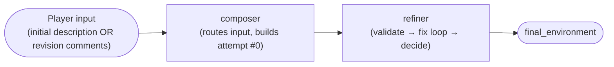
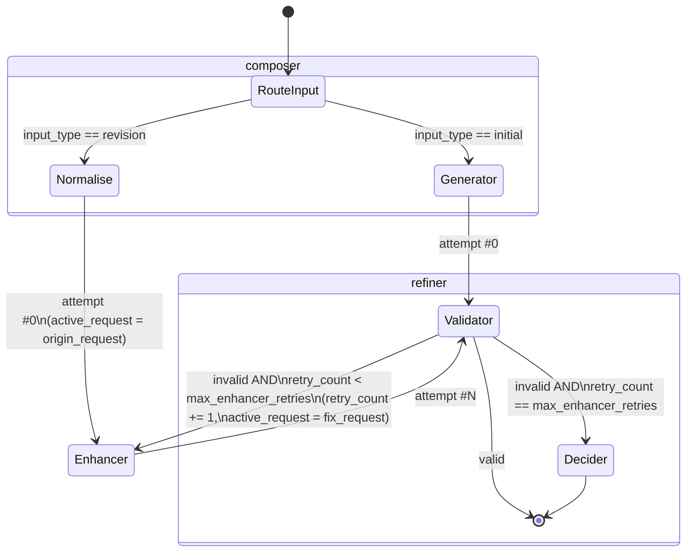

# Graph: Environment

## 1. Purpose & Scope

The `environment` graph produces the narrative "battle environment" (setting-consistent scene description) used by `/quick-battle`. It runs inside `AI Worker`, invoked as part of handling an `ai_tasks` message (per `architecture.md`'s Bot ↔ RabbitMQ ↔ AI Worker flow).

It has two entry modes, decided by the caller before invocation:

- **`initial`** — players have described environment elements from scratch; the graph must generate a brand-new environment.
- **`revision`** — an environment already exists and players have left comments requesting changes to it.

There is also a **third, deliberately out-of-scope mode**: if players choose not to describe a custom environment, `Bot` picks a pre-written UTF-8 arena from its own packaged `resources/generic_environments/*.txt` and **never invokes this graph**. Bot validates each file as non-empty and ≤4,000 characters, then constructs `Environment(description=text, tags=["generic", file_stem], setting=selected_setting)`. AI Worker does not mount or read generic arenas. This mirrors the legacy `custom_environment` toggle while keeping ownership with the only runtime consumer.

> **Confirmed design:** `environment` is a distinct expected `ai_task` before fighter collection; each revision is another task owned by the same Bot session. `battle` later receives the accepted `Environment` as input and never nests this graph. Canonical sequencing is `bot/commands/quick-battle.md`; there is no `ai_worker/graphs/quick-battle.md`.

---

## 2. Invocation Contract

**Input State:**

| Field | Type | Required | Description |
|---|---|---|---|
| `input_type` | `"initial" \| "revision"` | Yes | Selects the entry route (§4, §7). `"generic"` (pre-written arena, no AI) is deliberately **not** a value here — see §1, that mode never reaches this graph. |
| `raw_input` | `list[str]` | Yes | `1..10` trimmed entries: environment descriptions (`initial`, each `1..500` chars) or decline comments (`revision`, each `1..300` chars). **Confirmed as a list, not a single string.** Structurally invalid/blank/control-character input fails before an LLM call. Semantically odd but structurally valid revision input is creatively normalized rather than rejected (§6). |
| `setting` | `str` (enum) | Yes | Direct 1:1 match to a target `prompts/elements/setting/<name>.txt` file stem (no extra constraints object). Values: `realistic`, `realistic-urban`, `realistic-nature`, `dreamcore`, `unpredictable-realistic`, `unpredictable-dreamcore`, `unpredictable-funny`. |
| `language_locale` | `str` | Yes | Output language/locale after Bot mapping (`contracts/localization.md` §4), e.g. `uk-UA` when the guild stored `ua`. Injected via `prompts/elements/language.txt`'s `{locale}` slot. Kept as its own top-level field. **Do not expect raw UI keys like `ua` here.** |
| `existing_environment` | `Environment \| null` | Only for `revision` (must be `null` for `initial` — enforced, see §9) | The environment being modified. See `Environment` shape in §5. |
| `max_enhancer_retries` | `int` | No — defaults to `ENVIRONMENT_MAX_ENHANCER_RETRIES` (§8) | `0..3`; ceiling on Validator-driven retries. Callers may lower but never raise the v1 cap. |
| `trace_id`, `guild_id` | `str` | Yes | Correlation metadata for logging, consistent with `architecture.md`'s structured log format. |
| `api_key`, `model` | `str` | Yes | **Added this revision** — the requesting guild's own Gemini credential/model pair (`contracts/guild_config.md` §3), attached by `Bot` when it publishes the `ai_tasks` message (`ai_worker.md` §1/§4, closing that doc's credential gap). Every LLM-backed node in this graph uses these, not any worker-level default. Never logged (`ai_worker.md` §7). |

**Output State:**

| Field | Type | Description |
|---|---|---|
| `final_environment` | `Environment` | The environment returned to the caller — either a `Validator`-approved candidate or `Decider`'s pick. |
| `attempts_used` | `int` | Total recorded candidates, exactly `len(attempts)` (`1..4`). Attempt #0 is included. |
| `forced_selection` | `bool` | `true` if no candidate ever passed `Validator` and `Decider` had to choose among imperfect attempts; `false` if some candidate was cleanly approved. |

---

## 3. Graph Structure

The graph is split into **two phases**, each organized as its own node group (project owner's decision — this is the "split into 2" the flow was evaluated for):

1. **`composer`** — resolves `input_type` and produces the very first candidate (`attempt #0`).
   Nodes: `RouteInput` → `Generator` (initial) **or** `Normalise` → `Enhancer` (revision, first pass).
2. **`refiner`** — the reusable propose → critique → retry loop. Single entry point: `Validator`.
   Nodes: `Validator` → (loop) `Enhancer` → `Validator`, up to `max_enhancer_retries` times → `Decider` (fallback only).

`Enhancer` is defined once (`graphs/environment/nodes/enhancer.py`) and used by **both** phases: by `composer` for the revision path's first pass, and by `refiner` for every `Validator`-driven retry afterward. This is intentional reuse of one node across two phases, not duplication — see §6.

> **`refiner` is now a confirmed shared pattern, not just a reusability idea (resolved).** `battle` (`graphs/battle.md`) needed the exact same propose → critique → retry → decide shape, so `Validator` **and** `Decider` are now both documented once in `ai_worker/nodes.md` rather than here. `Enhancer` remains this graph's own "fixer" node — see `ai_worker/nodes.md` §4 for why the fixer itself is never shared across graphs.

---

## 4. Graph Diagram

**Phase-level overview:**



**Detailed state diagram:**



Note how `Enhancer` sits outside both composite boxes: it is entered once from `composer` (attempt #0, revision only) and re-entered from `refiner`'s loop (attempts #1..N) — same node, two call sites, per §3.

---

## 5. State Schema (Internal)

`ModificationRequest`, `ValidatorVerdict`, and `AttemptRecord` are now defined once in `ai_worker/nodes.md` §1 (the shared `refiner` contract) — not redefined here. This graph's `AttemptRecord.candidate` is an `Environment`, and `AttemptRecord.source` uses `"initial"` for attempt #0 (whether it came from `Generator` or `Normalise`+`Enhancer`'s first pass) and `"fixer"` for every `Enhancer`-driven retry.

```python
class Environment(TypedDict):
    """Confirmed minimal shape (project owner) — kept freeform on purpose to stay LLM-friendly.
    Injected into any prompt via the `environment.txt` element's `## Environment:\n{env}` wrapper
    (ai_worker/prompts.md §3/§4.1; legacy name custom_environment.txt) — `{env}` is `description`
    alone; `tags`/`setting` are graph-state bookkeeping, not part of what actually gets sent back
    into a prompt as the environment text itself."""
    description: str            # the actual narrative text — what {env} resolves to
    tags: list[str]              # short keyword elements, cheap structured signal for Validator/Decider
    setting: str                 # which elements/setting/<name>.txt (ai_worker/prompts.md §3) produced/last touched this environment

class EnvironmentGraphState(TypedDict):
    # --- Input contract (§2) ---
    input_type: Literal["initial", "revision"]
    raw_input: list[str]
    setting: str
    language_locale: str
    existing_environment: Environment | None
    max_enhancer_retries: int
    trace_id: str
    guild_id: str
    api_key: str                  # per-guild Gemini credential, added this revision — see §2
    model: str                    # per-guild Gemini model, added this revision — see §2

    # --- Working / internal-only ---
    origin_request: ModificationRequest | None   # Normalise's output (revision only); kept separate
                                                  # from active_request so the player's original ask
                                                  # survives across Validator-driven retries
    active_request: ModificationRequest | None   # the request Enhancer applies THIS pass:
                                                  #   attempt #0 (revision) -> origin_request
                                                  #   attempt #N (retry)    -> previous fix_request
    current_environment: Environment
    attempts: list[AttemptRecord]
    retry_count: int             # increments only on Validator-driven retries (attempt #0 is not a retry)

    # --- Output contract (§2) ---
    final_environment: Environment
    attempts_used: int
    forced_selection: bool
```

`Environment` validation is exact: `description` is trimmed/NFC-normalized and `1..4,000` characters; `tags` contains `1..12` unique trimmed strings of `1..32` characters; `setting` exactly equals the invocation setting. Unknown fields are rejected.

### 5a. Exact LLM structured outputs

| Node | Structured output |
|---|---|
| `Generator` | `Environment` |
| `Normalise` | `ModificationRequest {instruction: str (1..1,000), origin: "player", reason: null}` |
| `Enhancer` | `Environment` |
| `Validator` | Shared `ValidatorVerdict` with the environment rubric (`nodes.md` §2a) |
| `Decider` | Shared `DeciderSelection {selected_attempt_index, reason}` (`nodes.md` §3) |

The strict parser/coercion policy is canonical in `nodes.md` §1a. Malformed output uses the shared LLM retry budget; it never reaches the behavioral Validator.

`origin_request` vs `active_request` is the one non-obvious modeling choice here: without keeping the player's original revision request separate, a few `Validator`-driven quality fixes in a row could quietly drift the environment away from what the player actually asked for, since `active_request` gets overwritten every retry.

---

## 6. Nodes

| Node | Phase | Responsibility | Reads | Writes | LLM call | Prompt file(s) | Location |
|---|---|---|---|---|---|---|---|
| `RouteInput` | `composer` | Pure conditional routing on `input_type`. | `input_type` | — | No | none | `graphs/environment/nodes/route_input.py` (graph-specific) |
| `Generator` | `composer` | Generates a brand-new environment by synthesizing all of `raw_input` (one description per player) into one arena, directed by `setting` + `language_locale`. Never reads `existing_environment` (must be `null` on this path — see §9). | `raw_input`, `setting`, `language_locale` | `current_environment`, `attempts[0]` | Yes | `ai_worker/prompts.md` §4.1 — `graphs/environment/generator.txt` (already written, content migrating from legacy `environment_combiner.txt`) | `graphs/environment/nodes/generator.py` (graph-specific) |
| `Normalise` | `composer` | Converts free-text player comments into a `ModificationRequest`. **By design, never rejects input** — see design decision below. | `raw_input`, `existing_environment`, `setting`, `language_locale` | `origin_request`, `active_request` | Yes | `ai_worker/prompts.md` §4.1 — `graphs/environment/normalise.txt` | `graphs/environment/nodes/normalise.py` (graph-specific) |
| `Enhancer` | `composer` (1st pass) + `refiner` (retries) | Applies `active_request` to `current_environment`, respecting `setting`/`language_locale`. Same function serves both call sites (§3). | `current_environment`, `active_request`, `setting`, `language_locale` | `current_environment`, appends `AttemptRecord` | Yes | `ai_worker/prompts.md` §4.1 — `graphs/environment/enhancer.txt` | `graphs/environment/nodes/enhancer.py` (graph-specific) |
| `Validator` | `refiner` | Judges whether `current_environment` satisfies `setting`'s standards; if not, formulates `fix_request`. | `current_environment`, `setting`, `language_locale` | `attempts[-1].validator_verdict`, `active_request` (on failure) | Yes | `ai_worker/prompts.md` §4.1, §5 — `nodes/validator_base.txt` (shared) + `graphs/environment/validator_criteria.txt` | `ai_worker/nodes/validation.py` — **shared with `battle`** (confirmed; environment-specific criteria are passed in as parameters, not hardcoded in the shared module) |
| `Decider` | `refiner` (fallback only) | Reached only when `retry_count == max_enhancer_retries` and the latest attempt is still invalid. Picks the best candidate from **all** recorded attempts. | `attempts` (full history, including attempt #0) | `final_environment`, `forced_selection = true` | Yes | `ai_worker/prompts.md` §4.1, §5 — `nodes/decider_base.txt` (shared) + `graphs/environment/decider_criteria.txt` | `ai_worker/nodes/decider.py` — **shared with `battle`** (confirmed, promoted from graph-specific in this revision — see `ai_worker/nodes.md` §3) |

> **Prompt inventory note:** the target prompt file structure and per-node mapping is authored
> and mounted at runtime — see `ai_worker/prompts.md`. Legacy
> `core/environment_combiner.txt` is reference-only; graph nodes use the target files named
> above.

> **Design decision — `Normalise` never fails (project owner):** even a comment with no apparent relevance must be creatively reinterpreted into a valid, setting-consistent modification request rather than erroring out — e.g. a player commenting just "peach" should become something like *"add a peach orchard to the scene"* or *"a giant peach crashes onto the battlefield"*, not a rejection. Consequently there is **no** "normalization failed" failure mode in this graph — see §9's explicit note on this.

---

## 7. Control Flow: Routing & Loop Termination

- **Entry routing:** a single conditional edge on `input_type`, decided once at `RouteInput`, never revisited.
- **Loop:** `Validator ↔ Enhancer`, bounded by `max_enhancer_retries` (default and hard maximum `3`). `retry_count` increments **only** on Validator-driven retries — the revision path's first Enhancer pass (attempt #0) does not count against the retry budget. The candidate pool is therefore at most four.
- **Exit conditions (mutually exclusive):**
  1. `Validator` finds `current_environment` valid → graph ends, `forced_selection = false`.
  2. `retry_count` reaches `max_enhancer_retries` and the latest attempt is still invalid → `Decider` → graph ends, `forced_selection = true`.
- **Decider's candidate pool is all recorded attempts, including attempt #0** (confirmed decision) — not just the 3 retries — since an earlier attempt may objectively be closer to standard than a later one that drifted during fixing.
- **No path returns to `Generator`** after the first pass. **No automatic full-regeneration fallback exists** if `Decider`'s pick still fails validation — `Decider`'s output is always final for v1 (confirmed decision; revisit only if this proves insufficient in practice).

---

## 8. Configuration / Tunable Parameters

| Name | Default | Description |
|---|---|---|
| `ENVIRONMENT_MAX_ENHANCER_RETRIES` | `3` | Ceiling on `Validator`-driven retries before falling back to `Decider`. Exposed as the graph input `max_enhancer_retries` (§2) so it can be overridden per-call, defaulting to this env var. |
| `AI_WORKER_LLM_MAX_RETRIES` | `2` (confirmed decision, §9) | Shared retry budget for transient Gemini API failures **and** malformed/unparseable structured LLM output — one unified wrapper around every LLM node call, not `environment`-specific. **Canonically defined in `ai_worker.md` §3** — not redefined here, this row exists only to explain why this graph's own Failure Modes (§9) depend on it. |
| `ENVIRONMENT_TASK_DEADLINE_SEC` | `600` | Hard worker-side wall-clock deadline from graph invocation through result construction. Retry attempts stop when the deadline cannot accommodate another call. |
| `ENVIRONMENT_MAX_INPUT_TOKENS` | `120000` | Cumulative input-token ceiling across all Gemini calls and retries. |
| `ENVIRONMENT_MAX_OUTPUT_TOKENS` | `30000` | Cumulative output-token ceiling across all Gemini calls and retries. |

> Naming follows the `HEAD_*`-style prefix convention from `head.md` §3. `ENVIRONMENT_MAX_ENHANCER_RETRIES` is graph-specific and belongs in this doc permanently; `AI_WORKER_LLM_MAX_RETRIES` is graph-agnostic and lives in `ai_worker.md` §3.

### 8a. Per-node Gemini output limits

These are hard `max_output_tokens` values supplied to Gemini for every API attempt, including retries:

| Node | Maximum output tokens |
|---|---:|
| `Generator` | `4096` |
| `Normalise` | `2048` |
| `Enhancer` | `4096` |
| `Validator` | `2048` |
| `Decider` | `1024` |

The limits reflect each node's maximum schema size: `Generator`/`Enhancer` may return the complete 4,000-character environment; `Normalise` returns one bounded modification request; `Validator` returns bounded issues plus at most one fix request; `Decider` returns only an attempt index and short reason. They are implementation constants, not environment variables or caller overrides.

Worst-case logical calls: initial path `Generator + 4 Validator + 3 Enhancer + Decider = 9`; revision path `Normalise + 4 Enhancer + 4 Validator + Decider = 10`. Before API retries, reserving every logical call at its per-node maximum totals `25,600` output tokens for initial and `27,648` for revision, so either complete path fits under `ENVIRONMENT_MAX_OUTPUT_TOKENS=30,000`. With two retries after the first API attempt, the absolute API-attempt caps are 27 and 30 respectively, but retries consume the same cumulative budget and may therefore terminate the task before those theoretical attempt caps.

Usage returned by Gemini is accumulated after every call. Before each API attempt, the worker reserves that node's configured maximum output and fails before calling if the remaining output budget cannot cover it. The configured `max_output_tokens` prevents an individual response from exceeding its reservation.

---

## 9. Failure Modes

| Failure | Detection | Recovery |
|---|---|---|
| Gemini API call fails/times out (any LLM node) | Exception from the AI client | **Confirmed decision:** a shared retry-with-backoff wrapper around every LLM node call, budget `AI_WORKER_LLM_MAX_RETRIES` (§8, default `2`). If exhausted, the whole task fails — surfaces as an `AiTaskResultFailed` via `ai_tasks_results` (`contracts/ai_task.md` §4), `node` set to whichever node's call ultimately failed. This wrapper is graph-agnostic (belongs to `ai_worker`, not `environment` specifically). |
| `Generator`/`Enhancer` returns structurally invalid output (fails schema parsing — not a content/quality issue) | Schema validation error on the node's own output, before it ever reaches `Validator` | **Confirmed decision:** unified into the *same* `AI_WORKER_LLM_MAX_RETRIES` budget as the row above — no separate structural-retry mechanism. Deliberately simple: one retry budget covers "the call failed" and "the call succeeded but returned garbage" alike. |
| `existing_environment` missing on `revision` input, or present on `initial` input | Input validation at `RouteInput`, before any LLM call | **Confirmed decision:** hard invocation error — this is treated as a caller bug, not a runtime condition to tolerate or silently coerce. Fails fast, no LLM spend wasted. |
| `max_enhancer_retries` reached with zero valid attempts | `retry_count == max_enhancer_retries` and the last verdict is still invalid | **Not a failure — expected, by-design path.** Routes to `Decider` per §7; `Decider`'s pick is always accepted as final (confirmed decision, no further escalation). |
| `Normalise` receives irrelevant/nonsensical player input | — | **Explicitly not a failure mode** — see the design decision in §6. `Normalise` has no error branch; it always produces a usable `ModificationRequest`. |
| Graph deadline or cumulative token budget would be exceeded | Monotonic deadline / accumulated Gemini usage | Stop before the next call and publish `AiTaskResultFailed` with the currently executing node (or task wrapper if between nodes). Never return a partial environment. |

---

## 10. Dependencies

| Dependency | Used by | Notes |
|---|---|---|
| `ai_worker/nodes.md` (shared contract doc) | `Validator`, `Decider`, and this doc's own state schema (§5) | Defines `ModificationRequest`/`ValidatorVerdict`/`AttemptRecord` once — this doc no longer redefines them. |
| `ai_worker/nodes/validation.py` (shared) | `Validator` | Shared with the `battle` graph (confirmed) — see §6. Environment-specific validation criteria (setting standards) are supplied as parameters, not hardcoded in the shared module. |
| `ai_worker/nodes/decider.py` (shared) | `Decider` | Shared with the `battle` graph (confirmed, promoted in this revision) — see §6 and `ai_worker/nodes.md` §3. |
| `ai_worker/prompts.md` (shared contract doc) | `Generator`, `Normalise`, `Enhancer`, `Validator`, `Decider` | Single source of truth for every prompt file this graph's nodes use, plus the injection pattern (system prompt + `elements/*` blocks) — see §6. Replaces individually citing `prompts/setting/*.txt`, `prompts/elements/language.txt`, `prompts/elements/environment.txt` here (previously `custom_environment.txt` — renamed, see `prompts.md` §6). |
| `docs/contracts/localization.md` | `Generator`, `Enhancer`, `Validator` (any node consuming `language_locale`) | Defines where `language_locale`'s value comes from (guild-level `/config`, currently shared with Bot UI locale) — resolves the previously-open sourcing question, see §2. |
| Google Gemini API | `Generator`, `Normalise`, `Enhancer`, `Validator`, `Decider` | Every node in this graph is LLM-backed except `RouteInput`. Failure/retry handling is now a confirmed decision — see §9. |
| `docs/contracts/task_progress.md` | All nodes (indirectly, via the Celery task wrapper) | Defines the phase-update messages this graph's execution should emit (`composing`/`refining`/`finishing`) — see §11 for this graph's specific phase mapping. |
| **Not a dependency (explicitly out of scope):** Bot-packaged `resources/generic_environments/*.txt` | — | These back the generic no-AI mode. Bot converts a selected file to `Environment`; this graph and AI Worker never read the files (§1). |

---

## 11. Logging & Observability

- Each node logs at `INFO` on entry/exit using the shared structured format from `architecture.md`'s Mosquitto section: `[%time%][%level%][ai_worker][graphs/environment/nodes/<node>]<trace_id, guild_id, attempt_index>: [%message%]`.
- Recommended minimum tags on every log line in this graph: `trace_id`, `guild_id`, `attempt_index`, `input_type`. Not formally required anywhere yet — proposed here for consistency with the rest of the system's logging convention.
- `attempts_used` and `forced_selection` (§2) could support future prompt-quality analysis, but P1.8 explicitly defers them from the v1 telemetry surface because no consumer/transport is approved (`ai_worker.md` §8, `contracts/telemetry.md` §2). Do not emit them as ad hoc metrics.
- **Discord-facing task progress** (confirmed decision, separate from the structured log stream above): this graph's node-level granularity is translated down to the generic `queued`/`launching`/`composing`/`refining`/`finishing` phase vocabulary defined in `docs/contracts/task_progress.md`, published over Mosquitto (`progress/ai_worker/<task_id>`), not RabbitMQ. This graph's specific phase mapping — which nodes count as `composing` vs `refining` vs `finishing` — is defined once in `task_progress.md` §6.1, not duplicated here, to avoid two sources of truth drifting apart.

---

## 12. Open Items / Future Work

- Prompt prose for `Normalise`, `Enhancer`, `Decider`, and Validator's environment criteria remains Phase 4 implementation work. Target files are fixed in `ai_worker/prompts.md`; schemas, validation, rubric, pool bound, token budget, and deadline are resolved here and in `nodes.md`.
- ~~`language_locale`'s origin is undocumented~~ — **resolved**: see `docs/contracts/localization.md`. Guild-level value, set via `/config`, currently shared with Bot UI localization. That contract's own §5 flags a likely future decoupling as not-yet-decided — not a concern for this graph doc.
- ~~Whether `refiner` should become a shared, reusable pattern~~ — **resolved**: yes, confirmed once `battle` needed the same shape. See `ai_worker/nodes.md`.
- Task boundaries are resolved: each initial/revision environment invocation is its own expected `ai_task`; battle is a later distinct task. Canonical session sequencing is `bot/commands/quick-battle.md`.
- The physical migration of `prompts/` on disk to the target structure in `ai_worker/prompts.md` §3 hasn't happened yet — this graph doc's prompt references (§6, §10) already describe the target paths, not the legacy ones.
- **Phase 2** may exercise this graph's **output contract** via the transport-shell canned result (`contracts/ai_task.md` §11) without running LangGraph nodes.
