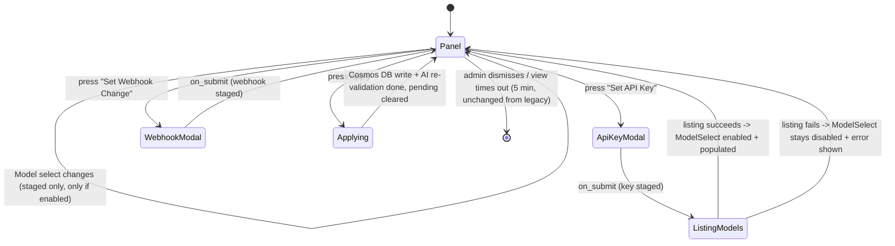

# Command: Config

> **Rewritten from scratch, legacy is reference only** (project owner) — `modules/ConfigurationHandler.py`'s `ConfigView`/`_pending_changes` flow is the source for *which staged-settings shape already exists* (per-field staging + one explicit Apply), not a spec to port 1:1. One behavior below deliberately diverges from legacy: Model selection is no longer free text typed alongside the API key — it becomes its own live-populated Select, sourced directly from Google's own model catalog (§6). Everything else (Language, Webhook, Apply gate) carries forward unchanged.

## 1. Purpose & Scope

Admin-only guild configuration panel: language, AI (Google API key + model), and webhook URL, all staged in-memory and committed together via one explicit Apply step (legacy's `_pending_changes` dict, now the `StagedSettingsView` pattern — `visuals.md` §3). Only the invoking guild's `administrator`s can run it (§4); guild-only, no DM support, and does **not** require the guild to already be enabled (`/config` is how a guild becomes enabled in the first place — same carve-out legacy applies). No subcommands, no options — entirely Select/modal driven.

## 2. File Structure

```
commands/config/
├── command.py                  # /config registration + admin permission check (§4)
├── models.py                   # StagedConfigChanges — in-memory staged edits, mirrors legacy's _pending_changes dict
├── UI/
│   ├── modals/
│   │   ├── api_key_modal.py    # Google API key ONLY now — Model moved off this modal onto the main view (§6)
│   │   └── webhook_modal.py    # Webhook URL — unchanged from legacy's WebhookConfigModal
│   └── views/
│       ├── language_select.py  # Command-specific Select — options are the 3 Bot UI locales (contracts/localization.md §2)
│       └── model_select.py     # Command-specific Select — options fetched live via service/model_catalog.py (§6)
└── service/
    └── model_catalog.py        # Wraps Google's client.models.list(), applies the gemini+generateContent filter (§6)
```

`StagedSettingsView` (the base container: staged in-memory changes + a single Apply button) is **shared** — defined once in `bot/modules/UI/views/staged_settings.py` per `visuals.md` §3; this command supplies its own child components (`LanguageSelect`, `ModelSelect`, the two modal-trigger buttons) into that base rather than reimplementing the stage/apply mechanics itself.

## 3. Invocation & Options

| | |
|---|---|
| **Command** | `/config` |
| **Subcommands** | None |
| **Source** | `bot/modules/commands/config/command.py` |

**Options:** None. The entire configuration surface is Select/modal driven inside the panel itself, carried forward 1:1 from legacy.

## 4. Permissions & Access Control

Requires the Discord `administrator` permission (`allowed_permissions={discord.Permissions.administrator: True}`, carried forward 1:1 from legacy `ConfigurationHandler.py`). Guild-only (`required_guild=True`); deliberately **does not** require the guild to already be enabled (`required_guild_enabled=False`) — this is how a guild first becomes enabled, so gating it on "already enabled" would be circular. A non-admin invoking it sees an explicit ephemeral permission-denied message (`ProcessCommand`'s existing behavior, `modules/utils.py`), never a silent failure. No cooldown, matching legacy.

## 5. Visuals Used

Per `visuals.md` §1's confirmed decision, this is a multi-field settings panel — more than a single trivial response — so it targets **Components V2**: `StagedSettingsView` becomes a `LayoutView`/`Container` (not legacy's classic `Embed`+`View`), with one `Section` per setting (Language, AI, Webhook) and the same Apply-button gate at the bottom.

| Piece | Shared or command-specific | Notes |
|---|---|---|
| `StagedSettingsView` | Shared (`visuals.md` §3) | Base container: staged in-memory dict + Apply button. This command is currently its only consumer — kept in the shared catalog on the expectation any future "N settings staged then applied" command reuses it, the same reasoning `quick-battle.md` §2 already applies to `LobbyView`/`SequentialCollector` despite those also having one consumer today |
| `LanguageSelect` | Command-specific (this doc) | Options = the 3 Bot UI locales (`contracts/localization.md` §2) |
| `ModelSelect` | Command-specific (this doc) | **New** — replaces legacy's free-text Model field inside `AIConfigModal`. Disabled with a placeholder until a valid API key is staged; populated live from `service/model_catalog.py` (§6) |
| `api_key_modal.py` | Command-specific | Single-field modal (API key only) — Model split out onto `ModelSelect` (§6); the one structural UI change from legacy's combined `AIConfigModal` |
| `webhook_modal.py` | Command-specific | Unchanged from legacy's `WebhookConfigModal` |

## 6. Interaction Flow

**Confirmed decisions baked into this flow** (project owner, this session):
- Model selection is promoted out of the API-key modal onto its own persistent Select on the main view (`ModelSelect`) — a Discord modal cannot populate a dynamic dropdown from a value entered in that same submission, so listing and picking a model must be separate round-trips.
- Before an API key is staged, or if the model-listing call fails (bad key, network error, zero results), `ModelSelect` stays disabled with an explicit placeholder/error message — there is **no** hardcoded fallback model list.
- Listed models are filtered to those where `supported_actions` includes `generateContent` **and** the model name contains `gemini` — mirrors `AIHandler`'s actual usage (`modules/AIHandler.py`) and excludes embedding-only/vision-only/legacy-PaLM models Google's API may also return.

**Step-by-step:**

1. Admin invokes `/config` (admin-permission gate, §4). Bot reads the guild's current config (Cosmos DB, §9) and renders `StagedSettingsView`: `LanguageSelect` defaulted to the configured locale, `ModelSelect` (populated using the *currently stored* key if one exists and still validates, else disabled), "Set API Key" button, "Set Webhook" button, Apply button. Ephemeral.
2. **Language:** admin picks a value on `LanguageSelect` → staged in-memory (mirrors legacy `_pending_changes`); view re-renders showing the pending value, no Apply yet.
3. **API key:** admin presses "Set API Key" → `api_key_modal.py` (single field) → on submit, the key is staged **and** immediately used to call `service/model_catalog.py`'s listing (§6):
   - **Listing succeeds** → `ModelSelect` is rebuilt, enabled, and populated with the filtered model list, defaulting to the previously-selected model if it's still present, else the first result.
   - **Listing fails** → `ModelSelect` stays disabled, with an inline/footer message telling the admin the key couldn't be verified (e.g. "Could not fetch models — check your API key") — per the confirmed no-fallback decision.
4. **Model:** if enabled, admin picks a value on `ModelSelect` → staged.
5. **Webhook:** admin presses "Set Webhook Change" → `webhook_modal.py` (unchanged from legacy) → staged.
6. **Apply:** admin presses Apply → all staged changes commit to the guild's Cosmos DB config document (§9) in one write. If an API key was staged, legacy's existing "is this key actually usable" check (`enableAI()`/`is_api_key_valid`, `modules/guild.py` / `modules/AIHandler.py`) still re-runs before flipping `enabled: true` — kept as a second check even though a successful model-listing call in step 3 already implies the key works, since listing and generating are technically different API calls (flagged as a possible redundant check to simplify later, §14). On failure, `enabled` stays/becomes `false` and the admin sees an inline warning, mirroring legacy's exact wording.
7. Panel stays open (ephemeral) after Apply — admin may keep adjusting and re-apply, or dismiss it. 5-minute view timeout, unchanged from legacy.

**Diagram:**



## 7. AI / Graph Integration

N/A — no `ai_tasks` message is ever sent by this command. The Google Gemini call this command makes (`service/model_catalog.py`'s `client.models.list()`, §6) is a direct, synchronous Bot→Google call for populating `ModelSelect`; it is unrelated to the `AI Worker`/RabbitMQ `ai_tasks` pipeline (`ai_worker.md`) that `/quick-battle` uses.

## 8. Backend / Service Logic

- **`service/model_catalog.py`** — the one piece of real logic this command owns: constructs a `google-genai` client with the *staged, not-yet-applied* API key, calls `client.models.list()`, applies the `generateContent` + `gemini`-name filter (§6), and returns a plain list of model IDs (or raises/returns empty on failure, so the UI layer can show the disabled/error state). Everything else is direct Discord-side orchestration (staging changes in `models.py`, committing to Cosmos DB) — no other `src/shared/` delegation beyond the guild-config read/write itself (§9).

## 9. Data Read/Written

| Destination/Source | Channel | Format | Trigger |
|---|---|---|---|
| Guild config (`Azure Cosmos DB`) | Read | Guild config document (`contracts/guild_config.md` §3) | Step 1 (panel open) |
| Guild config (`Azure Cosmos DB`) | Write | Guild config document — only the admin-configured fields: `language`, `api_key`, `model`, `webhook_url`, `enabled` (`contracts/guild_config.md` §4). This command never touches the Discord-sourced metadata fields (`name`, `icon_url`, `member_count`, `owner_id`) — those are `bot/discord_bot.md` §6.2's responsibility exclusively | Step 6 (Apply) |
| Google Gemini API (`client.models.list()`) | Read (external, not Azure) | Model catalog | Step 3, every time an API key is (re-)staged |

## 10. Localization

UI strings live under the `commands.config.*` namespace, already established in legacy's `lang/*.json` (`config.embed.*`, `config.messages.*`). **New keys needed, not present in legacy:** `ModelSelect`'s disabled/placeholder text and the listing-failure message (§6) have no legacy equivalent. No AI-generated content is ever displayed by this command, so `contracts/localization.md` §2's "two systems" split doesn't apply here beyond the fact that this command is the mechanism that *sets* the guild's shared `language`/`language_locale` value for everything else.

## 11. Logging

Per-action tags: `guild_id`, `command: "config"`, plus command-specific: which field was staged (`language`/`api_key`/`model`/`webhook_url`) and the model-listing outcome (`success`/`failure`). The API key itself is **never** logged, at any level — same convention `azure.md` §7 already applies to `AZURE_CLIENT_SECRET`, extended here to this command's own secret, and restated at the container level in `bot/discord_bot.md` §7 since it applies to every code path that reads the field back, not just this command.

**Storage note:** `api_key` is stored in **plaintext** in the Cosmos DB document (`contracts/guild_config.md` §7's confirmed v1 decision) — this is a scoped exception to "never persist secrets in the clear," accepted for this pass on the grounds that it matches legacy's own plaintext local-JSON behavior, not a new regression. Flagged as a security follow-up, not reopened here.

## 12. Failure Modes

| Failure | Detection | Recovery |
|---|---|---|
| Non-admin invokes `/config` | `ProcessCommand`'s permission check (§4) | Explicit ephemeral "you lack permission" message, panel never shown |
| Model-listing call fails (bad key, network, zero results) | Exception/empty result from `client.models.list()` | `ModelSelect` stays disabled with an inline error (§6) — no fallback list; Apply still works for any other staged fields |
| Staged API key fails the Apply-time validity check (§6 step 6) | `enableAI()`/`is_api_key_valid` returns `False` | `enabled` set/stays `false`, inline warning shown — same wording as legacy |
| Cosmos DB unreachable on Apply | Exception from `cosmos.py` | Not specified beyond `azure.md` §9's generic "surfaced to the calling service" note — no command-specific recovery yet, flagged in §14 |
| Panel times out (5 min, unchanged from legacy) | View `timeout=300` fires | Staged-but-unapplied changes are lost, matches legacy exactly |

## 13. Dependencies

| Dependency | Used for | Notes |
|---|---|---|
| `bot/visuals.md` | `StagedSettingsView`, design system colors | §5 |
| `contracts/localization.md` | Guild `language`/`language_locale` value this command sets | §3 there names `/config` as the exact mechanism |
| Google Gemini API (`google-genai`) | Model listing (§6) + API key validity check (§6 step 6) | External, not an Azure resource — outside `azure.md`'s scope |
| `azure.md` §3 | Guild config Cosmos DB read/write | Don't redefine variables here |
| `contracts/guild_config.md` | The exact document schema this command reads/writes | Shared with `bot/discord_bot.md` §6.2 (Discord-metadata fields) and `Web`'s `pages/guilds.md`/`pages/dashboard.md` (read-only) |

## 14. Open Items / Future Work

- **Apply-time key re-validation may be redundant** with the model-listing call already performed in step 3 (§6) — both hit Google's API; one lists models, one generates content. Worth collapsing into a single check once implemented; not decided here.
- **Discord Select's 25-option cap** — if Google's `gemini` + `generateContent` catalog ever exceeds 25 entries, `ModelSelect` would need pagination/truncation. Not an issue today, unhandled if it changes.
- **Cosmos DB failure handling on Apply** has no command-specific recovery defined (§12) — inherits `azure.md` §9's generic gap.
- **`StagedSettingsView`'s exact shared API** (how a command supplies its own child Sections/buttons into the base container) isn't designed yet — `visuals.md` §4 already flags the component catalog as candidate-only; this command is simply its first concrete consumer.
