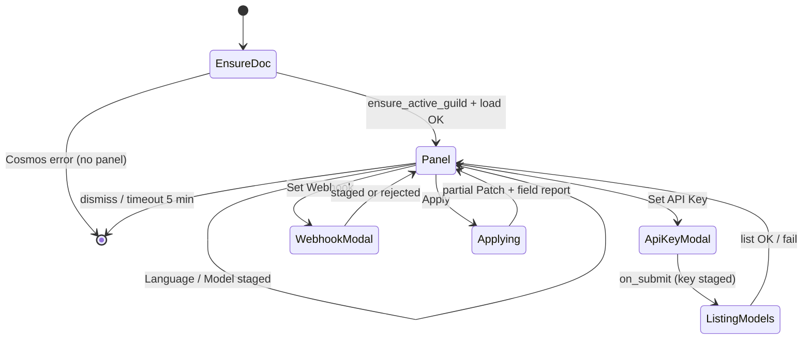

# Command: Config

> **Rewritten from scratch, legacy is reference only** (project owner) — `modules/ConfigurationHandler.py`'s `ConfigView`/`_pending_changes` flow is the source for *which staged-settings shape already exists* (per-field staging + one explicit Apply), not a spec to port 1:1. Model selection is a live-populated Select from Google's model catalog (§6), not free text. Apply semantics are normative in `contracts/guild_config.md` §8.

## 1. Purpose & Scope

Admin-only guild configuration panel: language, AI (Google API key + model), and webhook URL, all staged in-memory and committed via one explicit Apply (`StagedSettingsView` — `visuals.md` §3). Guild-only, administrator permission, does **not** require the guild to already be enabled. Available during drain (`ProcessCommand` `blocked_during_drain=False` — `discord_bot.md` §6.4). No subcommands, no options — entirely Select/modal driven.

**Phase 3:** this command is in scope. Offline guild-removal sweep is not.

## 2. File Structure

```
commands/config/
├── command.py                  # /config registration + ProcessCommand gates (§4)
├── models.py                   # StagedConfigChanges — in-memory staged edits
├── UI/
│   ├── modals/
│   │   ├── api_key_modal.py    # Google API key ONLY — Model on main view (§6)
│   │   └── webhook_modal.py    # Webhook URL
│   └── views/
│       ├── language_select.py  # Options en|es|ua (contracts/localization.md §3a)
│       └── model_select.py     # Options from service/model_catalog.py (§6)
└── service/
    └── model_catalog.py        # google-genai list + filter + Apply probe (§6)
```

`StagedSettingsView` is **shared** (`bot/modules/UI/views/staged_settings.py` per `visuals.md` §3).

## 3. Invocation & Options

| | |
|---|---|
| **Command** | `/config` |
| **Subcommands** | None |
| **Source** | `bot/modules/commands/config/command.py` |

**Options:** None.

## 4. Permissions & Access Control

Via `ProcessCommand` (`discord_bot.md` §6.4):

| Flag | Value |
|---|---|
| `required_guild` | `True` |
| `required_guild_enabled` | `False` |
| `allowed_permissions` | administrator |
| `blocked_during_drain` | `False` |

Non-admin → ephemeral permission-denied. Development mode: only `DISCORD_DEVELOPMENT_GUILD_ID`; DMs rejected by `required_guild`. No legacy developer bypass. No cooldown.

## 5. Visuals Used

Components V2: `StagedSettingsView` as `LayoutView`/`Container` with one `Section` per setting (Language, AI, Webhook) and Apply at the bottom.

| Piece | Shared or command-specific | Notes |
|---|---|---|
| `StagedSettingsView` | Shared (`visuals.md` §3) | Staged in-memory dict + Apply |
| `LanguageSelect` | Command-specific | `en` \| `es` \| `ua` |
| `ModelSelect` | Command-specific | Disabled until listing succeeds; max 25 options (§6) |
| `api_key_modal.py` | Command-specific | API key only |
| `webhook_modal.py` | Command-specific | Allowlist on stage/Apply |

## 6. Interaction Flow

### 6.1 First-use document ensure

1. Admin invokes `/config` (gates §4).
2. If no active guild document: call `ensure_active_guild()` with current Discord metadata, create/reactivate with defaults (`contracts/guild_config.md` §5/§7/§7a), then load.
3. Transient Cosmos error → ephemeral retry message; permanent → operator-facing error; **never** render a panel on an unpersisted fake document.
4. On success, render `StagedSettingsView` (ephemeral): `LanguageSelect` from stored language; `ModelSelect` populated from listing with the *currently stored* key if present and listable, else disabled; Set API Key / Set Webhook / Apply.

### 6.2 Staging

**Confirmed decisions:**

- Model selection is on the main view (`ModelSelect`), not inside the API-key modal.
- Before a usable key exists, or if listing fails, `ModelSelect` stays disabled with an explicit placeholder/error — **no hardcoded fallback model list**.
- Listed models: name contains `gemini` **and** `supported_actions` includes `generateContent`.

**Steps:**

1. **Language:** select → stage; re-render pending value.
2. **API key:** modal submit → stage key → **immediately** run model **listing** (§6.3):
   - Success → rebuild `ModelSelect` (≤25 options), enable, default to previous model if still present else first result; show truncation notice if applicable.
   - Failure → keep `ModelSelect` disabled + inline invalid-key / transient error.
3. **Model:** if enabled, select → stage.
4. **Webhook:** modal → stage; validate Discord-host allowlist (`web_auth.md` §7) on stage; reject invalid with localized error.
5. **Apply:** build and commit per `contracts/guild_config.md` §8 (partial-field transaction). Report which fields applied vs rejected. Panel stays open; 5-minute view timeout.



### 6.3 Google model validation (`google-genai`)

| Rule | Detail |
|---|---|
| SDK | `google-genai` |
| Event loop | Synchronous SDK calls **must** run via `asyncio.to_thread()` (or equivalent) — never block the Discord loop |
| Listing trigger | Every successful API-key modal stage (and initial panel open when a stored key exists) |
| List filter | Retain Gemini models supporting `generateContent` |
| Sort | Deterministic sort by **canonical model ID** |
| Cap | Truncate to the **first 25** options; **no pagination in v1** |
| Truncation UX | Localized truncation notice on the panel |
| Truncation log | Redacted WARN (guild_id, count truncated) — **never** log the key |
| Apply-time probe | When Apply would commit a **new** key and/or **new** model, perform **one** minimal `generateContent` probe with the smallest practical output limit **before** including those fields in the Patch |
| Probe secrets | Never log the key, prompt/response body, or raw provider exception text |
| Error mapping | Map provider failures to localized: invalid-key, unavailable-model, rate-limit, transient-service |

Listing success alone does **not** flip `enabled`; the Apply probe (or existing stored validated pair) gates `enabled=true` per `guild_config.md` §8.4–§8.5.

## 7. AI / Graph Integration

N/A — no `ai_tasks`. Direct Bot→Google calls for listing/probe only.

## 8. Backend / Service Logic

- **`service/model_catalog.py`** — `google-genai` client with staged/stored key; `models.list()` filter/sort/truncate; Apply-time `generateContent` probe; typed error mapping.
- Guild read/write via `GuildRepository` / `contracts/guild_config.md` — field-scoped ETag Patch only.

## 9. Data Read/Written

| Destination/Source | Channel | Format | Trigger |
|---|---|---|---|
| Guild config | Read / `ensure_active_guild` | `GuildConfigDocument` | Panel open |
| Guild config | Conditional Patch | Admin fields only (`guild_config.md` §4/§8) | Apply |
| Google Gemini API | External | Model list + probe | Key stage / Apply |

`api_key` stored **plaintext** in Cosmos (`guild_config.md` §8.1).

## 10. Localization

Namespace `commands.config.*`. Required Phase 3 keys include: permission denied, Cosmos transient/permanent, listing failure, truncation notice, Apply field applied/rejected summaries, invalid webhook, invalid-key / unavailable-model / rate-limit / transient-service, enabled gate warning. Exact key names remain P2; presence of localized strings is required.

## 11. Logging

Tags: `guild_id`, `command: "config"`, staged field names, listing/probe outcome (`success`/`failure` class). **Never** log API key, probe prompt/response, or raw provider exceptions.

## 12. Failure Modes

| Failure | Detection | Recovery |
|---|---|---|
| Non-admin / wrong guild / DM | `ProcessCommand` | Ephemeral denial; no panel |
| Missing document + ensure fails | Cosmos classification | Transient → retry; permanent → operator message; no fake panel |
| Model listing fails | Empty/exception from list | `ModelSelect` disabled + inline error; other fields still Appliable |
| Apply probe fails for new key/model | Mapped provider error | Exclude key/model from Patch; preserve previous values; inline field error; other valid fields may still commit |
| Invalid webhook | Allowlist | Exclude; previous URL unchanged |
| `enabled=true` without valid key/model | Gate §8.4 | Do not commit `enabled=true`; warning |
| ETag conflict exhausted | 412 budget | Reload panel; require review/retry; no success toast |
| Cosmos unreachable on Apply | Classified error | Keep staged state; localized transient/permanent error; no success |
| Panel timeout (300s) | View timeout | Staged-but-unapplied changes lost |

## 13. Dependencies

| Dependency | Used for |
|---|---|
| `discord_bot.md` §6.4 | `ProcessCommand` |
| `contracts/guild_config.md` §7a/§8 | First-use + Apply policy |
| `contracts/localization.md` | Language enum + UI strings |
| `contracts/web_auth.md` §7 | Webhook allowlist |
| `google-genai` | List + probe |
| `azure.md` / repositories | Cosmos access |

## 14. Open Items / Future Work

- Exact shared `StagedSettingsView` API shape — P2 / visuals hygiene.
- `api_key` at-rest encryption — deferred (`guild_config.md` §9).
- Offline guild-removal sweep — deferred (not Phase 3).
- Model-catalog pagination beyond 25 — explicitly out of v1 (truncate + notice only).
