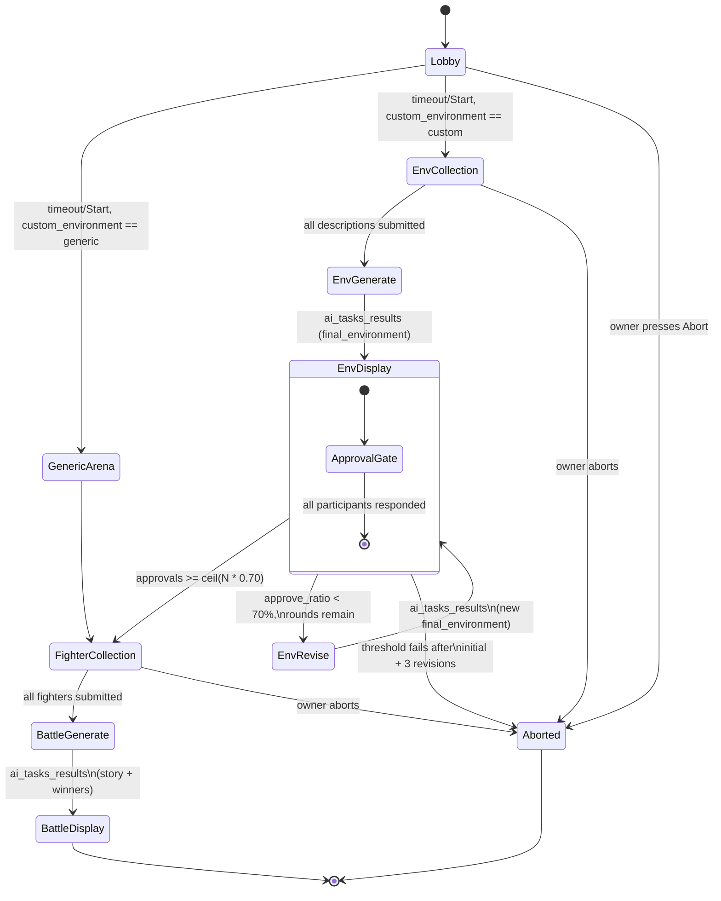

# Command: Quick Battle

> **Rewritten from scratch, legacy is reference only** (project owner) — `docs/legacy/Old_arch.md`'s `BattleHandler.py`/`QuickBattleRequest` flow is a useful source for *which interaction shapes already exist* (lobby, sequential per-player collection, button+modal patterns), not a spec to port 1:1. Several behaviors below deliberately diverge from legacy — most notably the complete-ballot threshold gate (§6) — and are documented as new decisions, not corrections.

## 1. Purpose & Scope

The flagship command: a multiplayer, AI-judged text battle. The invoking user (`owner`) opens a lobby other guild members can join; once started, the group collectively builds a battle environment (either AI-generated from player input, or a static pre-written arena), each participant submits a fighter, and `AI Worker`'s `battle` graph (`graphs/battle.md`) narrates the fight and declares winner(s). Anyone in the guild can invoke it (no special Discord permission, matches legacy's `allowed_permissions=[]`) — guild-only, no DM support (guild config is required for `setting`/`language_locale` defaults, per `contracts/localization.md`).

Two structurally distinct sub-flows exist depending on the `custom_environment` option (§3):
- **Generic** — a pre-written static arena, no AI call, no ballot gate (§6, `environment.md` §1's explicit "third mode").
- **Custom** — players describe the environment, `AI Worker` generates it, every eligible participant casts a complete ballot, and the candidate proceeds only when the `ceil(70%)` approval threshold is met (§6). This is threshold approval, not unanimity.

## 2. File Structure

```
commands/battle/
├── command.py                       # /quick-battle registration + options (§3)
├── models.py                        # Fighter, EnvironmentVote, LobbyState
├── UI/
│   ├── modals/
│   │   ├── environment_modal.py     # One free-text environment description (SequentialCollector step)
│   │   ├── decline_reason_modal.py  # Captures a decliner's modification suggestion (§6)
│   │   └── fighter_modal.py         # Merged name + description + strategy, ONE round (§6, confirmed — see note below)
│   └── views/
│       └── environment_approval_view.py   # Per-player Approve/Decline gate (§6) — command-specific, NOT
│                                            # promoted to bot/visuals.md yet (single consumer so far, per
│                                            # visuals.md's own "≥2 commands" promotion rule)
└── service/
    ├── environment_phase.py         # Builds/sends the environment ai_task (initial + revision calls),
    │                                 # tallies approval votes, drives the ballot loop (§6, §7)
    └── battle_process.py            # Top-level orchestration: lobby -> environment phase -> fighter
                                       # collection -> battle ai_task -> result display
```

`LobbyView` and `SequentialCollector` (used for environment-description and fighter collection) are **shared** — defined once in `bot/modules/UI/` per `visuals.md` §3, not duplicated here.

## 3. Invocation & Options

| | |
|---|---|
| **Command** | `/quick-battle` |
| **Subcommands** | None |
| **Source** | `bot/modules/commands/battle/command.py` |

**Options:**

| Name | Type | Required | Choices | Description |
|---|---|---|---|---|
| `custom_environment` | Choice (int) | Yes | `0` = Generic, `1` = Custom | Selects the environment sub-flow (§1). Carried forward from legacy 1:1. |
| `timeout` | int (range 30–600) | No, default `60` | — | Lobby countdown in seconds before the battle auto-starts (§6). Carried forward from legacy 1:1. |
| `setting` | Choice (str) | No, default `unpredictable-funny` | One of `environment.md` §2's 7 confirmed setting values (`realistic`, `realistic-urban`, `realistic-nature`, `dreamcore`, `unpredictable-realistic`, `unpredictable-dreamcore`, `unpredictable-funny`) | Directs tone/rules for both the `environment` and `battle` graphs. Default matches legacy's fallback behavior. |

**Not a command option (confirmed decision, project owner):** `random_winner_mode` — `battle.md` §2's input field is **hardcoded to `false`** for this version (always emergent/narrative winner resolution via `ResolveWinners`, never `Predefine`-scripted). Revisit if a future revision wants to expose it.

**Command-specific configuration (confirmed):**

| Variable | Default | Rule |
|---|---:|---|
| `QUICKBATTLE_MAX_PARTICIPANTS` | `10` | Hard lobby maximum; minimum is `1`. |
| `QUICKBATTLE_ENVIRONMENT_INPUT_TIMEOUT_SEC` | `120` | Shared deadline for parallel environment submissions. |
| `QUICKBATTLE_BALLOT_TIMEOUT_SEC` | `120` | Complete-ballot deadline; one missing vote aborts. |
| `QUICKBATTLE_FIGHTER_INPUT_TIMEOUT_SEC` | `180` | Shared deadline for parallel fighter submissions. |
| `QUICKBATTLE_MAX_ENVIRONMENT_REVISION_ROUNDS` | `3` | Three revisions after the initial candidate; four candidates total. |
| `QUICKBATTLE_AI_ADMISSION_TIMEOUT_SEC` | `60` | Maximum wait for the node-wide single AI-task slot. |
| `QUICKBATTLE_INVOKER_COOLDOWN_SEC` | `600` | Ten-minute cooldown for the original invoker. |
| `QUICKBATTLE_GUILD_COOLDOWN_SEC` | `300` | Five-minute guild cooldown after terminal completion. |

## 4. Permissions & Access Control

No Discord permission check — any guild member can invoke. Guild-only. Before creating a lobby, `ProcessCommand` requires an active guild document (`left_at == null`), `enabled == true`, nonblank previously validated API key, and nonblank model. It does not re-probe Gemini. Failure is an ephemeral localized denial and creates neither workflow count nor cooldown.

One lobby may exist per guild, and one user may belong to at most one lobby in that guild. A conflicting invocation returns a localized reference to the existing lobby. The original invoker's 10-minute cooldown begins when the lobby is accepted; the guild's 5-minute cooldown begins at terminal completion. Rejected invocations do not consume cooldown. One outstanding AI task (queued or running) is allowed per Bot node; each graph phase waits at most 60 seconds for admission before the workflow fails busy (`contracts/ai_task.md` §5a).

Lobby/membership/cooldown state is in-memory and uses monotonic deadlines. It resets with the confirmed Bot restart-expiry policy; no Cosmos cooldown document is introduced.

**`blocked_during_drain=True`** (confirmed decision, `bot/discord_bot.md` §6.4) — this is the one command opted into `ProcessCommand`'s drain gate. During retained `control/bot/desired_state = draining` or a bounded draining grant, new invocations are rejected with a localized "temporarily unavailable" response while existing work follows the drain-completion policy resolved in `contracts/drain_status.md` (P0.3).

**Which stages count toward `in_flight_workflows` (`contracts/drain_status.md` §1) — resolved:** every open lobby (step 1), environment description/ballot loop (steps 2–5), fighter collection (step 6), and battle task (step 7) are the **same single unit** for one invocation. It decrements exactly once on step 8, Abort, restart expiry, or terminal failure/timeout.

**What "cancelled for update" looks like to the user:** if a drain timeout escalates to `Head`'s hard-stop sequence while this lobby/collector/vote/task is still open (`contracts/drain_status.md` §2), `Bot` edits whichever message currently holds the active view (`LobbyView`, `SequentialCollector`, `EnvironmentApprovalView`, or the `TaskProgressContainer`) to a localized "update in progress, please retry" notice and disables its components, before Gateway disconnect — no partial result is synthesized or shown.

## 5. Visuals Used

All new UI in this command targets **Components V2** (`visuals.md` §1) — no classic `Embed`+`View` usage, since every step here is more than a single trivial response.

| Piece | Shared or command-specific | Notes |
|---|---|---|
| `LobbyView` | Shared (`visuals.md` §3) | Step 1 (§6) — join/leave/start/abort + countdown |
| `SequentialCollector` | Shared (`visuals.md` §3) | Used twice: environment descriptions (custom path only) and the merged fighter modal (§6) |
| `TaskProgressContainer` | Shared (`visuals.md` §3, concrete design in §3.1) | Used for **every** `environment`/`battle` `ai_task` call — including each revision-loop iteration (§6, §7), not just the first. Renders as the fixed 5-line `Queued`/`Launching`/`Composing`/`Refining`/`Finishing` checklist (`visuals.md` §3.1); the underlying task map/subscription plumbing lives in `bot/discord_bot.md` §6.3, not per-command |
| `EnvironmentApprovalView` | **Command-specific** (this doc) | New pattern — per-player Approve/Decline gate with a threshold outcome (§6). Not promoted to `visuals.md` yet since no other command needs a "poll with a threshold" pattern today; flagged in §14 as a promotion candidate if that changes |
| Winner highlight | Command-specific, part of the final battle container | Uses Success/green and exact `winners` IDs. Ordinary UI uses `AllowedMentions.none()`; only this line allows the exact winner users, with roles/everyone/replied-user disabled. If a winner is no longer mentionable, render the escaped snapshot name. Empty winners render a localized “no victor” result. |

## 6. Interaction Flow

**Confirmed decisions baked into this flow** (project owner):
- Fighter name + description + strategy are collected in **one merged modal**, one collection round — not legacy's two sequential rounds.
- Every eligible participant must explicitly Approve or Decline within 120 seconds. Declining requires a `1..300` character modification comment. Required approvals are `ceil(eligible_voter_count * 0.70)`. If the threshold fails, invoke at most three revisions. A failed fourth ballot aborts; continuing to fighter collection is forbidden.
- The final battle message highlights zero or more exact winner IDs. A solo participant may survive or die; the command never assumes that one fighter implies one winner.
- Each major phase posts its **own new message** (lobby, environment progress, environment display + approval gate, fighter collection, battle progress, battle result) — not one message edited throughout, matching legacy's `sendMessage`-per-phase pattern.

### 6.1 Session ownership, roster, and availability

- Lobby size is `1..10`; the invoker is the initial participant and owner. Solo play is valid.
- Join/Leave is available only while the lobby is open. Owner has Start/Abort. If the owner becomes unavailable, ownership transfers to the earliest joined participant still available; if none remains, abort.
- Start/countdown expiry freezes a participant snapshot (ID, display name, join order). No participant may join afterward; the active roster may only shrink.
- Environment and fighter collectors run in parallel under their shared deadlines. Remove each missing/unavailable submitter when at least one submitted participant remains; otherwise abort. A participant who already submitted remains represented by snapshot ID even if they later leave Discord.
- Ballot membership is the active roster for that candidate. Every member must vote; a missing vote aborts and is never interpreted as Approve or Decline.
- Owner Abort remains available in every nonterminal phase, including while an AI task is running.
- All submitted strings are trimmed, Unicode-NFC normalized, and reject control characters plus literal `@everyone`/`@here`. Any user text later echoed still uses no allowed mentions.

### 6.2 Interaction and message ownership

The initial slash command and every button/modal interaction are acknowledged or deferred within Discord's acknowledgement window. After acknowledgement, every phase message/send/edit uses the authenticated Bot client with `guild_id`, `channel_id`, optional `thread_id`, and `message_id`. Interaction tokens are never retained or “re-fetched.”

Ordinary lobby/collector/progress/result UI uses `AllowedMentions.none()`. There is no `@everyone` ping. The sole exception is the final winner line, whose allowed-user list is exactly the validated winner IDs.

**Step-by-step:**

1. **Lobby** (`LobbyView`) — post without mentions. `1..10` participants may join/leave; current owner may Start or Abort. Countdown uses the option's 30–600-second range/default 60 and auto-starts with the current roster. Start freezes the participant snapshot.
2. **Environment branch** on `custom_environment`:
   - **Generic:** uniformly choose a Bot-packaged UTF-8 arena from `src/bot/resources/generic_environments/*.txt`. Validate nonblank/≤4,000 chars and convert to `Environment(description=text, tags=["generic", stem], setting=selected_setting)`. No AI call; skip to step 6.
   - **Custom:** prompt the snapshot roster in parallel for one `1..500` character description under a 120-second deadline. Remove missing submitters if at least one remains; otherwise abort. Then proceed to step 3.
3. **Environment generation** — wait ≤60 seconds for the node AI slot, then publish `environment`/`initial`. Record it as the session's sole expected task ID, graph, and revision `0`. A new `TaskProgressContainer` tracks progress.
4. **Environment display + complete ballot** — accept only the expected result. Split the ≤4,000-character description at paragraph boundaries into pieces ≤1,900 characters (at most three); attach Approve/Decline to the final stable message. Decline requires a `1..300` character comment. Every active participant must respond within 120 seconds; one missing vote aborts.
5. **Threshold check:**
   - approvals `>= ceil(active_roster_count * 0.70)` → proceed to step 6 (fighter collection).
   - **<70% approve**, revision rounds remain → re-invoke `environment` graph, `input_type: "revision"`, `existing_environment` = current candidate, `raw_input` = decliners' comments only (approvers contribute nothing to this list). New `TaskProgressContainer`, back to step 4 with the new candidate.
   - threshold fails after revision `3` (initial + three revisions/four candidates total) → abort with the last environment displayed; do not continue.
6. **Fighter collection** — prompt in parallel under a 180-second deadline for `fighter_name` (`1..80`), `description` (`1..1,000`), optional strategy (`1..500`). Remove missing submitters if at least one remains; otherwise abort. This is consistently step 6.
7. **Battle generation** — wait ≤60 seconds for the AI slot, publish one expected `battle` task with final roster, accepted environment, setting, locale, and `random_winner_mode:false`.
8. **Battle display** — accept only the expected result. Deliver `story` in paragraph-bound chunks ≤1,900 characters: at most three messages; if longer, send a ≤1,900-character preview plus full UTF-8 `.txt` attachment. Render exact validated winners or localized no-victor text. Archive the full untruncated story best-effort (§9).

**Diagram:**



## 7. AI / Graph Integration

Two distinct graphs are separate `ai_tasks`: `environment` may run once initially plus up to three revisions; `battle` runs exactly once after threshold approval.

| | `environment` (`graphs/environment.md`) | `battle` (`graphs/battle.md`) |
|---|---|---|
| **Invoked** | `initial` once, then at most three `revision` calls | Once after a ballot meets threshold |
| **Key inputs** | `input_type`, `raw_input` (all descriptions on `initial`; decliners' comments only on `revision`), `setting`, `language_locale`, `existing_environment` (revision only) | `fighters`, `environment` (the accepted candidate), `setting`, `language_locale`, `random_winner_mode: false` (§3) |
| **Progress UI** | Own `TaskProgressContainer` per invocation (§6 step 3/5) | Own `TaskProgressContainer` (§6 step 7) |
| **Result consumed** | `final_environment` → displayed + voted on (§6 step 4) | `story` + `winners` → final message (§6 step 8); `player_nick` stays a Bot-side display/mention-fallback snapshot and is excluded from every LLM prompt |

`language_locale` and `setting` are sourced identically for both calls, per `contracts/localization.md` §3/§4 — this command never resolves them itself beyond reading the guild's configured locale and the `setting` command option.

For every invocation, the session stores one expected task ID, graph, and revision number. Replacing an environment task makes the prior ID superseded before the new publish. Progress/results for unknown, late, wrong-graph, or wrong-revision IDs are discarded. The stable delivery reference is channel/thread/message IDs, never an interaction token (`contracts/ai_task.md` §6).

## 8. Backend / Service Logic

- **`battle_process.py`** — top-level orchestrator; owns the lobby, sequences environment phase → fighter collection → battle phase, and posts the final result (§6 steps 1, 6, 7, 8).
- **`environment_phase.py`** — complete-ballot loop: initial/revision tasks, `ceil(70%)`, three-revision cap, and terminal abort on exhaustion.

### 8.1 Abort, timeout, and restart matrix

| Cause | Views/session | Open AI task | User-visible result |
|---|---|---|---|
| Owner Abort in any phase | Disable active components; terminal cleanup; decrement workflow once | If present, `revoke(terminate=True)`, remove expected/map entries | Bot-authenticated localized abort acknowledgement |
| Lobby/collector/ballot deadline | Apply §6 outcome; terminal paths disable UI and decrement once | None unless a separately running task exists | Localized timeout/roster/ballot failure |
| AI admission 60s | Terminal cleanup | Nothing published | Localized busy/timeout |
| AI stall 120s / overall 900s | Terminal cleanup | Do **not** revoke; forget expected ID; eventual result discarded | Distinct localized task timeout |
| Worker failed result | Terminal cleanup | Already terminal | Localized generation error |
| Hard-stop/update | Disable/edit tracked surface | Purge/revoke per `ai_task.md` §8 | “Update in progress; retry” |
| Bot restart | In-memory session expires; stale components return ephemeral session-expired | Late progress/results discarded | User must start again |

Participant Leave exists only in the open lobby. After snapshot, unavailable participants follow §6.1: missing collector submissions shrink the roster if at least one remains; a submitted fighter remains by snapshot identity; a missing ballot aborts.

## 9. Data Read/Written

| Destination/Source | Channel | Format | Trigger |
|---|---|---|---|
| `RabbitMQ` (`ai_tasks`) | Publish | `environment` or `battle` input contract (§7) | Steps 3, 5 (each revision round), 7 |
| `RabbitMQ` (`ai_tasks_results`) | Consume | `environment` or `battle` output contract (§7) | Correlated response to each of the above |
| `Mosquitto` (`progress/ai_worker/<task_id>`) | Consume | `task_progress.md` §4 phase messages | Drives every `TaskProgressContainer` live update |
| `Azure Blob Storage` | Write | Battle result archive — `contracts/battle_archive.md` (`.txt` + `.meta.json`) | Step 8, after Discord delivery is ready; best-effort (Discord not rolled back on archive failure) |
| Guild config (`Azure Cosmos DB`, via `contracts/localization.md`) | Read | `language_locale` | Steps 3, 5, 7 (every graph invocation) |

## 10. Localization

UI strings live under the `commands.quick-battle.*` namespace (already established in legacy's `lang/*.json` — `communication.*`, `environment.*`, `fighter.*`). **New keys needed, not present in legacy:** the ballot gate (`environment.approval.*` — Approve/Decline button labels, decline-reason modal, "regenerating" status text, threshold-not-met message) and winner/no-victor lines. The merged fighter modal (§6) collapses the legacy fighter/strategy rounds into one three-field group; exact key names remain implementation-owned.

## 11. Logging

Per-message and per-task tags: `trace_id`, `guild_id`, `command: "quick-battle"`, `task_id` (both `environment` and `battle` calls — a lobby produces multiple `environment` task IDs if revision rounds occur), plus command-specific: `participant_count`, `approval_round` (§6), `approve_ratio`.

## 12. Failure Modes

| Failure | Detection | Recovery |
|---|---|---|
| `environment` or `battle` task fails/exhausts retries/deadline/token budget | Failed result | Post localized error and abort; no partial resume |
| Approval threshold fails after initial + three revisions | Fourth complete ballot below `ceil(70%)` | Abort with last environment visible; do not continue |
| Participant misses environment/fighter deadline | Shared deadline | Remove missing submitters if at least one remains; otherwise abort |
| Participant misses ballot deadline | 120-second complete-ballot deadline | Abort; never infer a vote |
| Long flow outlives original interaction token | N/A by design | Every interaction is acknowledged; later sends/edits use authenticated Bot + stable IDs (§6.2) |
| Solo participant reaches battle | One final fighter | Valid. `outcome_type` may be `none` or `one`; empty winners render no-victor text |
| A drain timeout escalates to hard-stop while this lobby/collector/vote/task is open (**new this revision, P0.3**) | `Head`'s `HEAD_DRAIN_TIMEOUT_SEC` elapses with `in_flight_workflows > 0` (`contracts/drain_status.md` §2) | `Bot` edits the active view's message to a localized "update in progress, please retry" notice and disables its components before Gateway disconnect — see §4. No partial result is synthesized. |

## 13. Dependencies

| Dependency | Used for | Notes |
|---|---|---|
| `ai_worker/graphs/environment.md` | Steps 3, 5 | `initial`/`revision` contract |
| `ai_worker/graphs/battle.md` | Step 7 | `Fighter` shape, `winners` output |
| `contracts/task_progress.md` | Every `TaskProgressContainer` | Phase vocabulary + per-graph mapping |
| `contracts/localization.md` | `language_locale` sourcing | Guild-level, shared with Bot UI locale |
| `bot/visuals.md` | `LobbyView`, `SequentialCollector`, `TaskProgressContainer`, design system colors | §5, §3.1 |
| `bot/discord_bot.md` §6.3, §6.4 | Task-tracking plumbing behind `TaskProgressContainer`; the `blocked_during_drain` gate (§4) | Container-level infra, not redefined per-command |
| `contracts/drain_status.md` | `in_flight_workflows` counting (§4) and drain-timeout cancellation UX (§4) | Canonical drain contract, not redefined per-command |
| `contracts/guild_config.md` | `enabled` check (§4), `language`/`model` reads | Same document `/config` writes |
| `contracts/battle_archive.md` | Battle result Blob write | Canonical path/metadata/retention |
| `azure.md` §3 | Azure env vars | Don't redefine variables here |

## 14. Open Items / Future Work

- **`EnvironmentApprovalView` is a promotion candidate** for `bot/visuals.md` if any future command needs a similar per-participant poll-with-threshold pattern — stays command-specific for now per the "≥2 consumers" promotion rule.
- `random_winner_mode` is hardcoded `false` (§3) — if a future revision wants to expose scripted-winner mode, `battle.md` §12's own open item on that field's ideal source (guild config vs. per-lobby option) still applies.
- P1.1 session behavior is resolved. Remaining items here are promotion/future-exposure concerns and do not block Phase 5.
