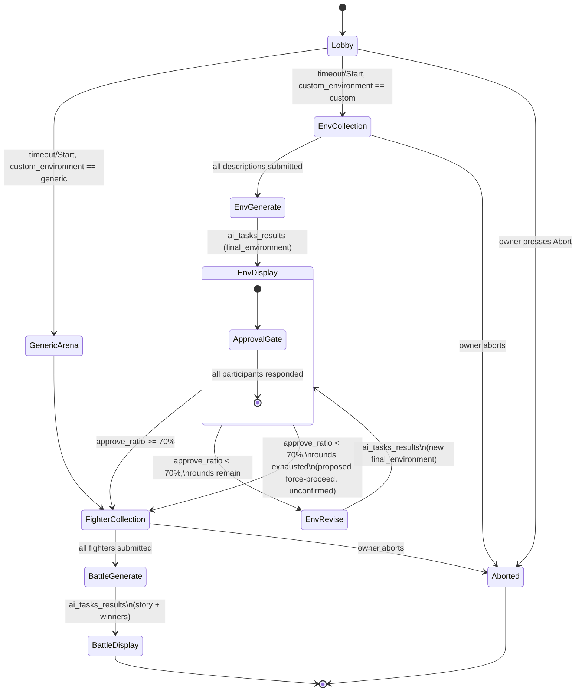

# Command: Quick Battle

> **Rewritten from scratch, legacy is reference only** (project owner) — `docs/legacy/Old_arch.md`'s `BattleHandler.py`/`QuickBattleRequest` flow is a useful source for *which interaction shapes already exist* (lobby, sequential per-player collection, button+modal patterns), not a spec to port 1:1. Several behaviors below deliberately diverge from legacy — most notably the environment consensus gate (§6) — and are documented as new decisions, not corrections.

## 1. Purpose & Scope

The flagship command: a multiplayer, AI-judged text battle. The invoking user (`owner`) opens a lobby other guild members can join; once started, the group collectively builds a battle environment (either AI-generated from player input, or a static pre-written arena), each participant submits a fighter, and `AI Worker`'s `battle` graph (`graphs/battle.md`) narrates the fight and declares winner(s). Anyone in the guild can invoke it (no special Discord permission, matches legacy's `allowed_permissions=[]`) — guild-only, no DM support (guild config is required for `setting`/`language_locale` defaults, per `contracts/localization.md`).

Two structurally distinct sub-flows exist depending on the `custom_environment` option (§3):
- **Generic** — a pre-written static arena, no AI call, no consensus gate (§6, `environment.md` §1's explicit "third mode").
- **Custom** — players describe the environment, `AI Worker`'s `environment` graph generates it, and **all participants must reach consensus before proceeding** (§6) — this is new relative to legacy, which only ever displayed the AI's first output.

## 2. File Structure

```
commands/battle/
├── command.py                       # /quick-battle registration + options (§3)
├── models.py                        # Fighter, EnvironmentVote, LobbyState
├── UI/
│   ├── modals/
│   │   ├── environment_modal.py     # One free-text environment description (SequentialCollector step)
│   │   ├── decline_reason_modal.py  # Captures a decliner's modification suggestion (§6)
│   │   └── fighter_modal.py         # Merged name + description + strategy, ONE round (§6, confirmed — see note below)
│   └── views/
│       └── environment_approval_view.py   # Per-player Approve/Decline gate (§6) — command-specific, NOT
│                                            # promoted to bot/visuals.md yet (single consumer so far, per
│                                            # visuals.md's own "≥2 commands" promotion rule)
└── service/
    ├── environment_phase.py         # Builds/sends the environment ai_task (initial + revision calls),
    │                                 # tallies approval votes, drives the consensus loop (§6, §7)
    └── battle_process.py            # Top-level orchestration: lobby -> environment phase -> fighter
                                       # collection -> battle ai_task -> result display
```

`LobbyView` and `SequentialCollector` (used for environment-description and fighter collection) are **shared** — defined once in `bot/modules/UI/` per `visuals.md` §3, not duplicated here.

## 3. Invocation & Options

| | |
|---|---|
| **Command** | `/quick-battle` |
| **Subcommands** | None |
| **Source** | `bot/modules/commands/battle/command.py` |

**Options:**

| Name | Type | Required | Choices | Description |
|---|---|---|---|---|
| `custom_environment` | Choice (int) | Yes | `0` = Generic, `1` = Custom | Selects the environment sub-flow (§1). Carried forward from legacy 1:1. |
| `timeout` | int (range 30–600) | No, default `60` | — | Lobby countdown in seconds before the battle auto-starts (§6). Carried forward from legacy 1:1. |
| `setting` | Choice (str) | No, default `unpredictable-funny` | One of `environment.md` §2's 7 confirmed setting values (`realistic`, `realistic-urban`, `realistic-nature`, `dreamcore`, `unpredictable-realistic`, `unpredictable-dreamcore`, `unpredictable-funny`) | Directs tone/rules for both the `environment` and `battle` graphs. Default matches legacy's fallback behavior. |

**Not a command option (confirmed decision, project owner):** `random_winner_mode` — `battle.md` §2's input field is **hardcoded to `false`** for this version (always emergent/narrative winner resolution via `ResolveWinners`, never `Predefine`-scripted). Revisit if a future revision wants to expose it.

## 4. Permissions & Access Control

No Discord permission check (`allowed_permissions=[]` in legacy, carried forward) — any guild member can invoke. Guild-only; requires the invoking guild to be configured/enabled (same implicit `ProcessCommand` guild requirement legacy applied to this command, unlike `/suggest` which explicitly opts out of it). **No cooldown exists today** — carried forward as a gap, not a deliberate choice; flagged in §14 as a candidate future addition (spam prevention on a command that triggers real AI Worker cost).

**`blocked_during_drain=True`** (confirmed decision, `bot/discord_bot.md` §6.4) — this is the one command opted into `ProcessCommand`'s drain gate. During a planned update sequence (`control/bot/drain`), new invocations are rejected with a localized "temporarily unavailable" response while any already-in-flight lobby/task is left to finish naturally within `Head`'s own drain window (`head.md` §6). `/config` and `/suggest` are **not** opted in — see `discord_bot.md` §6.4 for why only this command needs the gate.

## 5. Visuals Used

All new UI in this command targets **Components V2** (`visuals.md` §1) — no classic `Embed`+`View` usage, since every step here is more than a single trivial response.

| Piece | Shared or command-specific | Notes |
|---|---|---|
| `LobbyView` | Shared (`visuals.md` §3) | Step 1 (§6) — join/leave/start/abort + countdown |
| `SequentialCollector` | Shared (`visuals.md` §3) | Used twice: environment descriptions (custom path only) and the merged fighter modal (§6) |
| `TaskProgressContainer` | Shared (`visuals.md` §3, concrete design in §3.1) | Used for **every** `environment`/`battle` `ai_task` call — including each revision-loop iteration (§6, §7), not just the first. Renders as the fixed 5-line `Queued`/`Launching`/`Composing`/`Refining`/`Finishing` checklist (`visuals.md` §3.1); the underlying task map/subscription plumbing lives in `bot/discord_bot.md` §6.3, not per-command |
| `EnvironmentApprovalView` | **Command-specific** (this doc) | New pattern — per-player Approve/Decline gate with a threshold outcome (§6). Not promoted to `visuals.md` yet since no other command needs a "poll with a threshold" pattern today; flagged in §14 as a promotion candidate if that changes |
| Winner highlight | Command-specific, part of the final battle container | Uses `visuals.md` §2's Success/green accent; renders `🏆` + `@mention` per entry in `battle.md`'s `winners` output (confirmed decision — see §6, §7) |

## 6. Interaction Flow

**Confirmed decisions baked into this flow** (project owner, this session):
- Fighter name + description + strategy are collected in **one merged modal**, one collection round — not legacy's two sequential rounds.
- After the environment is generated and displayed, **every participant must explicitly Approve or Decline it** — the flow cannot proceed until all participants have responded. Declining requires a short modification-suggestion comment (captured via `decline_reason_modal.py`). If **≥70% of participants approve**, the flow proceeds to fighter collection. Otherwise, the environment graph is re-invoked in `revision` mode (`environment.md` §2), using the decliners' comments as `raw_input`, and the same approval gate repeats against the new candidate.
- The final battle message explicitly highlights winner(s) by `@mention`, using `battle.md`'s new structured `winners` field.
- Each major phase posts its **own new message** (lobby, environment progress, environment display + approval gate, fighter collection, battle progress, battle result) — not one message edited throughout, matching legacy's `sendMessage`-per-phase pattern.

**Proposed, not yet confirmed** (flagged explicitly rather than silently decided — see §14):
- **70% rounding rule:** proposed as `ceil(participant_count * 0.7)` approvals required (favors caution — regenerates more readily for small groups) — e.g. 3 participants needs all 3, 4 needs 3, 10 needs 7.
- **Consensus loop cap:** proposed `QUICKBATTLE_MAX_ENVIRONMENT_REVISION_ROUNDS` (default `3`), matching the naming convention of `ENVIRONMENT_MAX_ENHANCER_RETRIES`/`BATTLE_MAX_MODIFIER_RETRIES`. If exhausted with consensus still not reached, proposed fallback: **force-proceed with the last-generated candidate** (mirrors the existing `Decider`-exhaustion pattern already established in `ai_worker/nodes.md` — "accept the best available rather than block forever") rather than aborting the whole lobby.

**Step-by-step:**

1. **Lobby** (`LobbyView`) — owner invokes, `@everyone` ping + lobby message. Participants join/leave freely; owner can Start early or Abort; countdown auto-starts the battle at `timeout`. No minimum participant count — owner alone is a valid battle, per legacy.
2. **Environment branch** on `custom_environment`:
   - **Generic:** pick a static arena from `prompts/static/generic_environments/*.txt` (`ai_worker/prompts.md` §3) — no AI call, skip directly to step 6.
   - **Custom:** `SequentialCollector` prompts each participant once for a free-text description (button→modal, owner can abort). Once all descriptions are in, proceed to step 3.
3. **Environment generation** — `ai_tasks` message to the `environment` graph, `input_type: "initial"`, `raw_input` = all collected descriptions. New `TaskProgressContainer` message tracks `queued→launching→composing→refining→finishing` (`task_progress.md` §6.1).
4. **Environment display + consensus gate** — on `ai_tasks_results`, post the `final_environment.description` in a new message (Info/blurple, `visuals.md` §2) together with `EnvironmentApprovalView` (Approve / Decline buttons per participant). Decline opens `decline_reason_modal.py`. Waits for **every** participant to respond (no timeout, owner can still Abort — same as legacy's other collection steps).
5. **Consensus check:**
   - **≥70% approve** (proposed rounding above) → proceed to step 7 (fighter collection).
   - **<70% approve**, revision rounds remain → re-invoke `environment` graph, `input_type: "revision"`, `existing_environment` = current candidate, `raw_input` = decliners' comments only (approvers contribute nothing to this list). New `TaskProgressContainer`, back to step 4 with the new candidate.
   - **<70% approve**, revision rounds exhausted → proposed force-proceed fallback (above) with the last candidate, flagged as unconfirmed in §14.
6. **Fighter collection** — `SequentialCollector` prompts each participant once for the merged name+description+strategy modal. Owner can abort.
7. **Battle generation** — `ai_tasks` message to the `battle` graph: `fighters` (mapped from Discord `Member.id`→`player_id`, `Member.display_name`→`player_nick`, per `battle.md` §5's `Fighter` shape), `environment` (from step 4/5's accepted candidate), `setting`, `language_locale`, `random_winner_mode: false` (§3). New `TaskProgressContainer` tracks `battle.md` §11's phase mapping (`composing` = `planner`+`storyteller`, `refining` = `Validator`↔`Modifier`, `finishing` = `Decider`?+`ResolveWinners`).
8. **Battle display** — on `ai_tasks_results`, post the final `story` text plus a `🏆` winner-highlight line (`@mention` per entry in `winners`), Success/green accent. Battle result also persisted to Azure Blob Storage (§9).

**Diagram:**



## 7. AI / Graph Integration

Two distinct graphs, invoked as separate `ai_tasks` (confirmed cross-graph relationship, `graphs/environment.md` §1) — `environment` may be invoked **multiple times** per lobby (once per consensus-loop round, §6), `battle` exactly once.

| | `environment` (`graphs/environment.md`) | `battle` (`graphs/battle.md`) |
|---|---|---|
| **Invoked** | Once per round: `initial` the first time, `revision` on every subsequent round (§6 step 5) | Once, after consensus is reached (or the fallback triggers) |
| **Key inputs** | `input_type`, `raw_input` (all descriptions on `initial`; decliners' comments only on `revision`), `setting`, `language_locale`, `existing_environment` (revision only) | `fighters`, `environment` (the accepted candidate), `setting`, `language_locale`, `random_winner_mode: false` (§3) |
| **Progress UI** | Own `TaskProgressContainer` per invocation (§6 step 3/5) | Own `TaskProgressContainer` (§6 step 7) |
| **Result consumed** | `final_environment` → displayed + voted on (§6 step 4) | `story` + `winners` → final message (§6 step 8) |

`language_locale` and `setting` are sourced identically for both calls, per `contracts/localization.md` §3/§4 — this command never resolves them itself beyond reading the guild's configured locale and the `setting` command option.

## 8. Backend / Service Logic

- **`battle_process.py`** — top-level orchestrator; owns the lobby, sequences environment phase → fighter collection → battle phase, and posts the final result (§6 steps 1, 6, 7, 8).
- **`environment_phase.py`** — everything specific to the consensus loop: sending `initial`/`revision` `ai_tasks` messages, tallying `EnvironmentVote`s, applying the 70% threshold (§6 step 5), and the round-cap fallback. Isolated from `battle_process.py` because this is the one phase with genuinely non-trivial control flow (a loop with an exit condition), matching why `architecture.md`'s file tree already carved out `service/environment.py` as an "Optional" file distinct from `battle_process.py`.

## 9. Data Read/Written

| Destination/Source | Channel | Format | Trigger |
|---|---|---|---|
| `RabbitMQ` (`ai_tasks`) | Publish | `environment` or `battle` input contract (§7) | Steps 3, 5 (each revision round), 7 |
| `RabbitMQ` (`ai_tasks_results`) | Consume | `environment` or `battle` output contract (§7) | Correlated response to each of the above |
| `Mosquitto` (`progress/ai_worker/<task_id>`) | Consume | `task_progress.md` §4 phase messages | Drives every `TaskProgressContainer` live update |
| `Azure Blob Storage` | Write | Battle result — `.txt` + JSON metadata, per `architecture.md`'s Data Storage table ("Battle Results") | Step 8, after `ai_tasks_results` lands |
| Guild config (`Azure Cosmos DB`, via `contracts/localization.md`) | Read | `language_locale` | Steps 3, 5, 7 (every graph invocation) |

## 10. Localization

UI strings live under the `commands.quick-battle.*` namespace (already established in legacy's `lang/*.json` — `communication.*`, `environment.*`, `fighter.*`). **New keys needed, not present in legacy:** the consensus gate (`environment.approval.*` — Approve/Decline button labels, decline-reason modal, "regenerating" status text, threshold-not-met message) and the winner-highlight line (`communication.winner_announcement` or similar). The merged fighter modal (§6) collapses what were separately `fighter.*` and `strategy.*` key groups in legacy into one `fighter.*` group with three fields instead of two rounds — exact key restructuring is an authoring detail, not decided further here.

## 11. Logging

Per-message and per-task tags: `trace_id`, `guild_id`, `command: "quick-battle"`, `task_id` (both `environment` and `battle` calls — a lobby produces multiple `environment` task IDs if revision rounds occur), plus command-specific: `participant_count`, `approval_round` (§6), `approve_ratio`.

## 12. Failure Modes

| Failure | Detection | Recovery |
|---|---|---|
| `environment` or `battle` `ai_task` fails/exhausts retries | Synthetic error result on `ai_tasks_results` (`ai_worker.md` §9's "light crash" pattern) | Post an error message to the channel, abort the lobby — no partial-progress resume exists |
| Consensus never reached within the round cap | `approval_round == QUICKBATTLE_MAX_ENVIRONMENT_REVISION_ROUNDS` (proposed default `3`, §6) | Proposed force-proceed fallback (§6) — **unconfirmed**, see §14 |
| A participant never responds to the approval gate | No timeout mechanism (inherited from legacy's identical gap on `FighterCreator`/`EnvironmentCreator`) | Not handled — owner's Abort button is the only escape hatch. Flagged in §14, not newly introduced by this doc |
| Discord interaction/follow-up token expires mid-flow | Discord API rejects a stale interaction response | **Not addressed** — this command's total wall-clock time is now human-response-bound (approval votes) on top of LLM latency, materially longer than legacy ever risked. Real, unresolved risk — see §14 |
| Lobby has zero non-owner participants at timeout | N/A — not actually a failure | Proceeds normally, owner alone is a valid battle (legacy behavior, unchanged) |

## 13. Dependencies

| Dependency | Used for | Notes |
|---|---|---|
| `ai_worker/graphs/environment.md` | Steps 3, 5 | `initial`/`revision` contract |
| `ai_worker/graphs/battle.md` | Step 7 | `Fighter` shape, `winners` output |
| `contracts/task_progress.md` | Every `TaskProgressContainer` | Phase vocabulary + per-graph mapping |
| `contracts/localization.md` | `language_locale` sourcing | Guild-level, shared with Bot UI locale |
| `bot/visuals.md` | `LobbyView`, `SequentialCollector`, `TaskProgressContainer`, design system colors | §5, §3.1 |
| `bot/discord_bot.md` §6.3, §6.4 | Task-tracking plumbing behind `TaskProgressContainer`; the `blocked_during_drain` gate (§4) | Container-level infra, not redefined per-command |
| `contracts/guild_config.md` | `enabled` check (§4), `language`/`model` reads | Same document `/config` writes |
| `azure.md` §3 | Battle result Blob Storage write | Don't redefine variables here |

## 14. Open Items / Future Work

- **70% rounding rule is proposed, not confirmed** (§6) — `ceil(participant_count * 0.7)` is a reasonable default but hasn't been explicitly signed off.
- **Consensus loop cap and its exhaustion fallback are proposed, not confirmed** (§6, §12) — both the default round count and "force-proceed with the last candidate" need explicit sign-off before implementation.
- **No timeout on approval votes or fighter/environment submissions** — inherited gap from legacy's identical behavior on `FighterCreator`/`EnvironmentCreator`, now arguably higher-stakes since the consensus gate can loop. Not resolved here.
- **Discord interaction token expiry risk** (§12) — this command's now-unbounded human-response time (consensus voting) needs a real answer (webhook-based messaging instead of interaction follow-ups? re-fetching a fresh token per phase?) that this doc doesn't attempt to solve.
- **`EnvironmentApprovalView` is a promotion candidate** for `bot/visuals.md` if any future command needs a similar per-participant poll-with-threshold pattern — stays command-specific for now per the "≥2 consumers" promotion rule.
- **Cooldown/rate-limiting** on this command doesn't exist (§4) — flagged as a gap given real AI Worker cost per invocation, not a deliberate absence.
- `random_winner_mode` is hardcoded `false` (§3) — if a future revision wants to expose scripted-winner mode, `battle.md` §12's own open item on that field's ideal source (guild config vs. per-lobby option) still applies.
