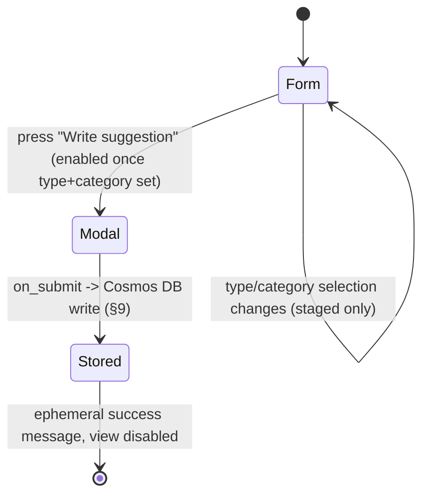

# Command: Suggest

> **Rewritten from scratch, legacy is reference only** (project owner) — `modules/main.py`'s `SuggestionView`/`SuggestionModal`/`suggestion_categories` flow is the source for *which interaction shape already exists* (Type Select + Category multi-select, then a modal-trigger button), not a spec to port 1:1. The one significant rework here is **where the type/category list lives and how `Bot` and `Web` both read it** (§6, §9) — the on-screen flow and the 8 existing category values/5 suggestion types themselves are carried forward unchanged (confirmed scope, project owner).

## 1. Purpose & Scope

Lets any user — guild member or DM, no permission required — submit a feedback/bug ticket: pick a type and one-or-more categories, then fill in a title + details modal. The resulting ticket is written to Cosmos DB and later reviewed/responded to by an admin via `Web`'s Suggestions page (`web/pages/suggestions.md`, `architecture.md` Scenario 3) — this command's own responsibility ends once the ticket is stored (§6 step 6). Usable in a guild or in a DM; does not require the guild (if any) to be configured/enabled. No subcommands, no options.

## 2. File Structure

```
commands/suggest/
├── command.py                     # /suggest registration — works in guild or DM (§3/§4)
├── models.py                      # SuggestionDraft — staged type/categories before the modal opens
├── UI/
│   ├── modals/
│   │   └── suggestion_modal.py    # Title + Details, unchanged shape from legacy SuggestionModal
│   └── views/
│       └── suggestion_view.py     # Type Select + Category multi-select + "Write suggestion" button (§5 — corrects visuals.md's WizardView entry)
└── service/
    ├── category_catalog.py        # Reads the shared type/category list from status.py's document (§6, §9) — NOT a local hardcoded list anymore
    └── suggestion_service.py      # Builds the suggestion payload, writes to Cosmos DB via src/shared/azure/services/suggestions.py
```

## 3. Invocation & Options

| | |
|---|---|
| **Command** | `/suggest` |
| **Subcommands** | None |
| **Source** | `bot/modules/commands/suggest/command.py` |

**Options:** None — matches legacy exactly; `executor` is an internal `ProcessCommand`-injected parameter, not a user-facing option.

## 4. Permissions & Access Control

No Discord permission check (`allowed_permissions={}`, carried forward from legacy). Not guild-only (`required_guild=False`) and does not require the guild to be enabled (`required_guild_enabled=False`) — deliberately the most permissive command in the bot, since feedback should be collectible even from a guild that hasn't configured AI yet, or from a DM with no guild at all. No cooldown.

## 5. Visuals Used

Legacy already shows the Type Select and Category multi-select **together in one view** (not one at a time), with a "Write suggestion" button that only opens the modal once both are chosen — a single-panel form + modal-trigger, not a sequential step-by-step wizard.

**Correction to `visuals.md` §3, applied in this pass:** the existing `WizardView` catalog entry describes "one step visible at a time," which doesn't match this command's actual (and only) real-world consumer. Proposed correction: rename/reframe that catalog row to describe the real pattern — a single view combining N selects with one modal-trigger button, gated on all selections being made — rather than leave a shared-catalog entry that describes behavior no command actually implements. Not applied to `visuals.md` itself in this pass (see §14); flagged here for whoever reconciles the catalog next.

| Piece | Shared or command-specific | Notes |
|---|---|---|
| `SuggestionView` (this doc's name; `visuals.md`'s candidate entry needs the correction above) | Command-specific | Type Select + Category multi-select + "Write suggestion" button, disabled until both selections are made |
| `suggestion_modal.py` | Command-specific | Title + Details, two fields, unchanged from legacy `SuggestionModal` |

Per `visuals.md` §1, this leans Components V2 (multiple interactive components: two selects + a button) rather than the "genuinely trivial single response" carve-out for classic `Embed`+`View` — consistent with `/quick-battle`'s default, though this is a much smaller surface than that command.

## 6. Interaction Flow

**Confirmed decisions baked into this flow** (project owner, this session):
- The rework is scoped to **storage/mechanism only** — the 8 existing category values and 5 suggestion types are carried forward unchanged, still plain English strings (no per-locale labels for this pass).
- Both lists now live in a **single shared document** — `azure.md`'s `services/status.py` (the existing `bot.json`-style document, extended with new fields), not two independent hardcoded Python lists duplicated between `Bot` and `Web`. This directly resolves the fact that `Bot` and `Web` have no direct network link (`web.md` §1) but both need the identical list — `Bot` for this command's Selects, `Web` for `pages/suggestions.md`'s filter/tag display. No new Azure service/file was introduced for this (a `categories.py` sibling to `status.py` was considered and rejected in favor of just extending `status.py` itself, since `status.py`'s document is already shared Bot/Web ground for name/version/invite-link-style fields).

**Step-by-step:**

1. User invokes `/suggest` (any guild member, or DM). Bot reads the current type/category list from the shared `status.py` document (§9) — cached, refresh cadence undecided (§14) — and renders `SuggestionView`: Type Select, Category multi-select, a disabled "Write suggestion" button. Ephemeral.
2. User picks a type and ≥1 category (both simply `defer()` — no message change, matches legacy) → the button becomes usable once both are set.
3. User presses "Write suggestion" → `suggestion_modal.py` (Title + Details, unchanged from legacy `SuggestionModal`).
4. On modal submit: the payload is built (title, details, type, categories, user/guild/locale metadata — same shape as legacy's `build_payload`, **including the existing `contact: {method: "dm", user_id: str(user.id)}` field**, carried forward unchanged) and written to **Cosmos DB** via `src/shared/azure/services/suggestions.py` — replacing legacy's local `generic/suggestions.json` file (`modules/utils.py`'s `append_suggestion_record`), matching the same local-file → Cosmos DB move already applied to guild configs in `commands/config.md` §9. A `ticket_uid` is generated as part of this write.
5. The view disables itself (mirrors legacy's `make_unavailable`); the user gets an ephemeral success message.
6. This command's job ends here — the rest of the ticket's lifecycle (an admin reading/responding via `Web`'s Suggestions page, `Bot`'s queue-poller eventually DMing the response via the `contact` field above) is `Web`'s and `Bot`'s own `queue_poller.py` responsibility (`architecture.md` Scenario 3 — corrected in this revision to say DM, not "Admin Channel" — and `bot/discord_bot.md` §6.6), not re-described in this doc.

No consensus gate, no AI Worker call, no lobby — this is a genuinely linear flow, but still gets a diagram per the template's "more than a single request/response" trigger (2 selects + 1 modal round-trip):



## 7. AI / Graph Integration

N/A — no `ai_tasks` message is ever sent by this command.

## 8. Backend / Service Logic

- **`service/category_catalog.py`** — reads the shared type/category list from the `status.py`-backed document (§9); this command no longer hardcodes the list itself.
- **`service/suggestion_service.py`** — builds the suggestion payload (mirrors legacy `build_payload`) and writes it to Cosmos DB via `src/shared/azure/services/suggestions.py`, replacing legacy's direct local-file read/write.

## 9. Data Read/Written

| Destination/Source | Channel | Format | Trigger |
|---|---|---|---|
| `status.py` shared document (`Azure Blob Storage`) | Read | Type/category list (§6) | Step 1 (panel render) — cached, not necessarily re-fetched every invocation (§14) |
| `Azure Cosmos DB` (Suggestions collection) | Write | Suggestion ticket, per legacy `build_payload`'s shape (title, details, type, categories, `contact: {method, user_id}`, guild/locale metadata, `ticket_uid`) | Step 4 (modal submit) |
| Azure Queue Storage (indirect — read by `Bot`'s `queue_poller.py`, not by this command) | — | Suggestion-response notification | Later, when an admin responds via `Web` — see `bot/discord_bot.md` §6.6, not this command's own flow |

**Note on the shared document's ownership:** the exact read/write split between `Bot` and `Web` for the type/category fields inside `status.py`'s document (who seeds the default list, who's allowed to edit it, and on what Azure resource `status.py` itself actually lands — Blob vs. something else) is **not decided in this doc**, per the project owner's explicit instruction to leave `status.py`'s own gap in `architecture.md`/`azure.md` open for now (`docs/Readme.md`'s note on this file). See §14 and the corresponding note added to `web/pages/suggestions.md` §9/§10.

## 10. Localization

UI strings (placeholders, button label, modal labels, success/error messages) stay under the `commands.suggest.*` namespace, unchanged from legacy's existing keys. The category/type **values themselves** stay plain English, un-localized, per the confirmed decision (§6) — a deliberate scope cut for this pass, not an oversight. No AI-generated content is involved in this command at all, so `contracts/localization.md`'s "two systems" split doesn't even apply here.

## 11. Logging

Per-action tags: `guild_id` (or absent for DM invocations), `command: "suggest"`, `ticket_uid` (once generated), plus the selected `type`/`categories` values for observability — unlike `/config`'s API key, these are non-sensitive and safe to log at `INFO`.

## 12. Failure Modes

| Failure | Detection | Recovery |
|---|---|---|
| Empty title/details submitted | Client-side validation on modal submit (unchanged from legacy) | Inline ephemeral error, modal can be resubmitted |
| Cosmos DB write fails | Exception from `cosmos.py` | Not handled distinctly in this doc — inherits `azure.md` §9's generic "surfaced to the calling service" gap; flagged in §14 |
| Shared type/category document (`status.py`) unreachable or missing fields | Exception/empty result from the read in §9 | **Undecided** — legacy never had this failure mode since the list was hardcoded in Python. Whether to fall back to a small hardcoded default list (mirroring `/config`'s explicit no-fallback stance for models, `commands/config.md` §12) or block the command outright is not decided — flagged in §14 |
| View times out (600s, unchanged from legacy) | View `timeout=600` fires | Matches legacy's `on_timeout` → `make_unavailable` |

## 13. Dependencies

| Dependency | Used for | Notes |
|---|---|---|
| `azure.md`'s `status.py` entry | Shared type/category list (§6, §9) | Storage location (this document) is confirmed (project owner); the exact read/write contract is still open (§14) — deliberately **not** touched in `azure.md` itself this pass |
| `azure.md` §3 | Suggestions Cosmos DB write | Don't redefine variables here |
| `web/pages/suggestions.md` | Downstream consumer of this command's Cosmos DB writes, and a second reader of the same shared category list | Cross-container, no direct link — mediated entirely through Cosmos DB + the shared `status.py` document |
| `bot/discord_bot.md` §6.6 | The queue-poller/DM-notification half of this ticket's lifecycle (§6 step 6) | Container-level background service, not part of this command's own request/response flow |

## 14. Open Items / Future Work

- ~~`visuals.md`'s `WizardView` catalog entry needs correcting~~ — **resolved**: `visuals.md` §3 now has the corrected `SuggestionView` entry (renamed, description matches the real single-view pattern) — applied in the same pass that drafted `discord_bot.md`.
- **Shared type/category document ownership is undecided** (§9) — who seeds/edits the default list inside `status.py`'s document, whether `Bot`, `Web`, or a manual process is the writer, and what either side does if the document is missing/malformed. Deliberately left open per the project owner's instruction not to expand `azure.md`'s `status.py` scope in this pass.
- **No fallback if the shared category list is unreachable** (§12) — unlike `/config`'s explicit no-fallback stance for models, there's no equivalent decision here yet.
- **Refresh cadence for the cached type/category list is undecided** (§6, §9) — startup-only (mirroring `update_bot_config`'s existing pattern) vs. periodic vs. per-invocation isn't chosen.
- Per-locale category/type labels were explicitly deferred (§6, §10, project owner) — revisit if a future pass wants Bot-UI-level i18n parity for suggestion content.
