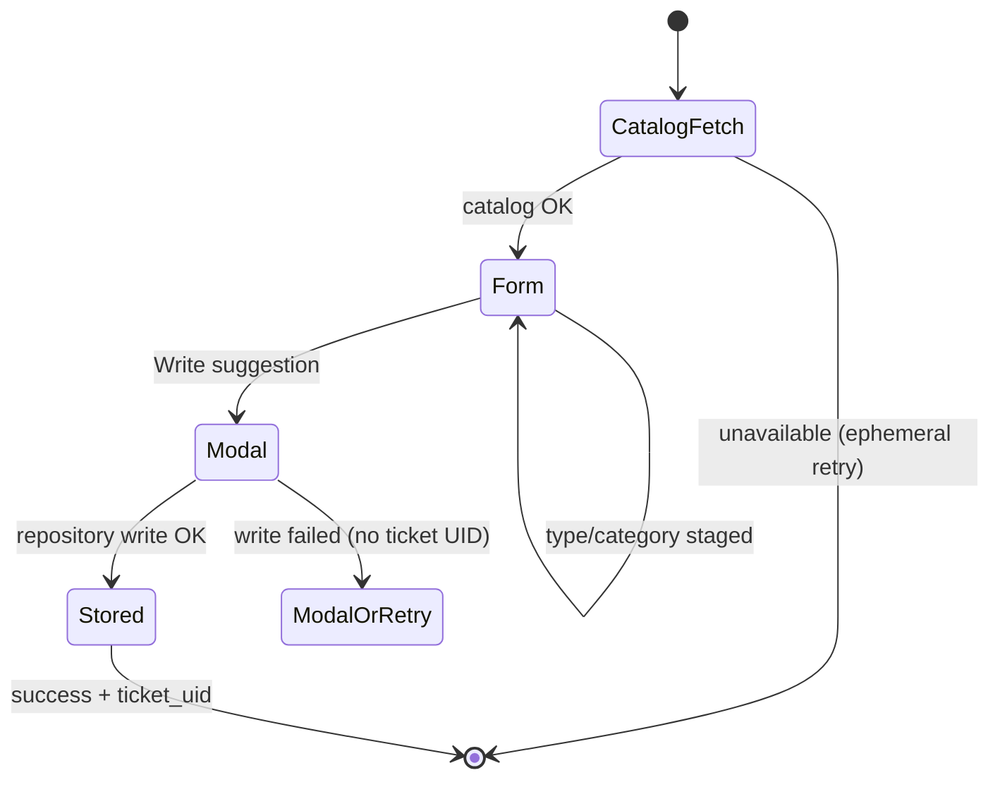

# Command: Suggest

> **Rewritten from scratch, legacy is reference only** (project owner). Interaction shape (Type Select + Category multi-select + modal) carries forward; catalog and ticket schema are owned by `contracts/status_document.md` and `contracts/suggestion.md`.

## 1. Purpose & Scope

Lets any user submit a feedback/bug ticket: pick a type and ≥1 categories, then title + details. Ticket is written to the suggestion store; admin review/response is Web (`web/pages/suggestions.md`); Discord DM delivery is Bot poller/sweep (`discord_bot.md` §6.6). No Discord permission required; does not require guild AI enabled. Available during drain.

**Phase 3:** command + catalog read + Cosmos/dev-support create + S12 coupling. Real AI graphs and `/quick-battle` are out of scope.

## 2. File Structure

```
commands/suggest/
├── command.py                     # /suggest + ProcessCommand (§4)
├── models.py                      # SuggestionDraft — staged type/categories
├── UI/
│   ├── modals/
│   │   └── suggestion_modal.py    # Title + Details
│   └── views/
│       └── suggestion_view.py     # Type + Category selects + modal trigger
└── service/
    ├── category_catalog.py        # StatusService.get_suggestion_catalog() (§6)
    └── suggestion_service.py      # Build SuggestionDocument + repository write
```

## 3. Invocation & Options

| | |
|---|---|
| **Command** | `/suggest` |
| **Subcommands** | None |
| **Source** | `bot/modules/commands/suggest/command.py` |

**Options:** None. `executor` is an internal `ProcessCommand`-injected parameter, not user-facing.

## 4. Permissions & Access Control

Via `ProcessCommand` (`discord_bot.md` §6.4):

| Flag | Value |
|---|---|
| `required_guild` | `False` |
| `required_guild_enabled` | `False` |
| `allowed_permissions` | none |
| `blocked_during_drain` | `False` |

### Production versus development (resolved conflict)

| Mode | Guild | DM |
|---|---|---|
| **Production** | Any guild except reserved `DISCORD_DEVELOPMENT_GUILD_ID` | **Allowed** — partition `guild_id = "dm"` |
| **Development** | **Only** `DISCORD_DEVELOPMENT_GUILD_ID` | **Rejected** ephemerally — no DM command exercise |

Development also **suppresses** Azure Queue enqueue and Discord response DM side effects for any later Web respond path (`contracts/local_development.md` §7). Cross-link: that contract §4/§7; this command §12.

No cooldown. No legacy developer bypass.

## 5. Visuals Used

Components V2: single-panel form (Type Select + Category multi-select + “Write suggestion” button gated until both set) + modal. Catalog entry in `visuals.md` is `SuggestionView` (not a sequential wizard).

| Piece | Shared or command-specific | Notes |
|---|---|---|
| `SuggestionView` | Command-specific | Selects show catalog **labels**; draft stores **values** |
| `suggestion_modal.py` | Command-specific | Title + Details |

## 6. Interaction Flow

### Catalog (`StatusService.get_suggestion_catalog()`)

| Rule | Detail |
|---|---|
| Source | `get_suggestion_catalog()` on the status document accessor (`contracts/status_document.md`) — **not** a hardcoded list |
| Fetch | On **every new** `/suggest` invocation (panel open) |
| Cache | Optional in-memory cache may remain valid **only** for the **600-second** view lifetime of that invocation; do not reuse across invocations |
| Fail closed | Missing, malformed, or unavailable catalog → **no panel**; localized ephemeral **retry** response |
| Fallback | **None** — no hardcoded type/category list |
| Submit re-validation | On modal submit, validate selected `type` / `categories` **again** against a fresh catalog read (or the same invocation cache if still within view lifetime and catalog was valid); reject stale values |
| Storage | Ticket stores catalog **values**, never labels |

**Step-by-step:**

1. User invokes `/suggest` (gates §4). Fetch catalog; on failure → ephemeral retry and stop.
2. Render ephemeral `SuggestionView` (timeout **600s**).
3. User picks type + ≥1 category → enable “Write suggestion”.
4. Modal: title + details.
5. On submit: re-validate catalog values; build `SuggestionDocument` (`contracts/suggestion.md`); **persist** via suggestion repository.
6. **Cosmos/repository success is required before showing a ticket UID.** On success: disable view; ephemeral success may include `ticket_uid`.
7. Command ends — no response notification is enqueued on initial create (`notification_status = null`).



## 7. AI / Graph Integration

N/A.

## 8. Backend / Service Logic

- **`category_catalog.py`** — `StatusService.get_suggestion_catalog()` only.
- **`suggestion_service.py`** — build document; write via `SuggestionRepository` (production Cosmos / development `dev-support`).

## 9. Data Read/Written

| Destination/Source | Format | Trigger |
|---|---|---|
| Status `suggestion_catalog` | `list[{value,label}]` | Every `/suggest` open (+ submit re-validate) |
| Suggestions store | `SuggestionDocument` | Modal submit |
| Queue Storage | — | **Not** on create; only later via Web respond (production) |

## 10. Localization

Namespace `commands.suggest.*`. Phase 3 requires localized: catalog unavailable/retry, validation errors, transient write failure, permanent write failure, success (with ticket UID), development DM rejection. Catalog labels remain English in v1 (per-locale labels P2). Ticket `locale` is structured `LocaleInfo`.

## 11. Logging

Tags: `guild_id` (or absent for production DM), `command: "suggest"`, Cosmos `id`, `ticket_uid` (only after successful create), `type`/`categories` values. Non-sensitive at INFO.

## 12. Failure Modes

| Failure | Recovery |
|---|---|
| Development DM / foreign guild | Ephemeral denial (`ProcessCommand` / §4) |
| Catalog missing/malformed/unavailable | Ephemeral localized retry; no hardcoded fallback; no panel |
| Stale type/category on submit | Reject; user must re-open `/suggest` or correct selections |
| Empty title/details | Client-side validation; resubmit modal |
| Transient repository write failure | Localized retry message; **no** ticket UID; **no** success response |
| Permanent repository write failure | Safe operator-facing ephemeral message; **no** ticket UID; **no** success |
| Duplicate Discord interaction | Must **not** create a second ticket (idempotent on interaction id / discord.py duplicate handling) |
| Preserve modal values after failure | Where discord.py allows re-showing the same modal with prior values, do so; otherwise document that the user must reopen the modal from the view (or re-invoke if the view timed out) |
| View timeout 600s | `make_unavailable` — draft lost |
| Initial create | Does **not** enqueue a response notification |

Propagated failure classification: `azure.md` §9 (suggestion writes fail the command; transient vs permanent surfaced per this table).

## 13. Dependencies

| Dependency | Notes |
|---|---|
| `discord_bot.md` §6.4 / §6.6 | ProcessCommand; delivery runtime |
| `contracts/status_document.md` | Catalog |
| `contracts/suggestion.md` | Ticket schema |
| `contracts/local_development.md` | Dev guild-only + suppressed DM/queue |
| `web/pages/suggestions.md` | Admin respond path |
| `azure.md` | Production Cosmos/Queue |

## 14. Open Items / Future Work

- Per-locale catalog labels — P2.
- Unrestricted multi-admin editing beyond ETag — deferred (`suggestion.md`).
- Suggestion list pagination for Web — P1.6 (not this command).
