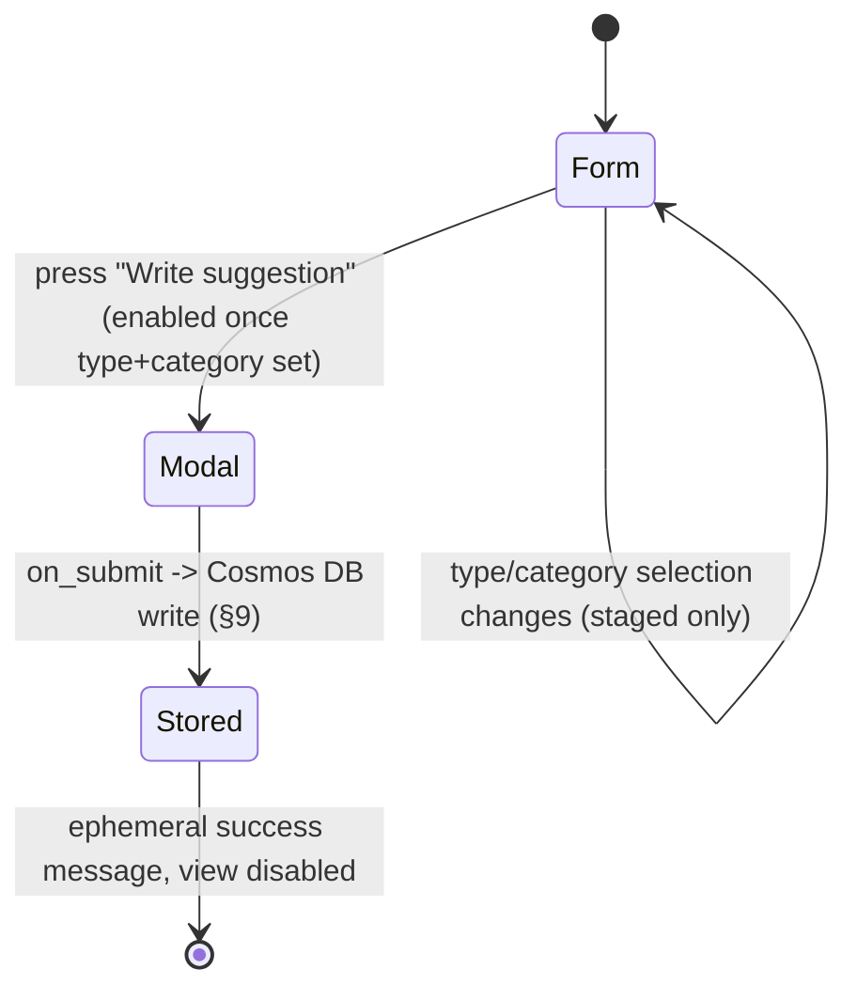

# Command: Suggest

> **Rewritten from scratch, legacy is reference only** (project owner) — `modules/main.py`'s `SuggestionView`/`SuggestionModal`/`suggestion_categories` flow is the source for *which interaction shape already exists* (Type Select + Category multi-select, then a modal-trigger button), not a spec to port 1:1. The one significant rework here is **where the type/category list lives and how `Bot` and `Web` both read it** (§6, §9) — the on-screen flow and the 8 existing category values/5 suggestion types themselves are carried forward unchanged (confirmed scope, project owner).

## 1. Purpose & Scope

Lets any user — guild member or DM, no permission required — submit a feedback/bug ticket: pick a type and one-or-more categories, then fill in a title + details modal. The resulting ticket is written to Cosmos DB and later reviewed/responded to by an admin via `Web`'s Suggestions page (`web/pages/suggestions.md`, `architecture.md` Scenario 3) — this command's own responsibility ends once the ticket is stored (§6 step 6). Usable in a guild or in a DM; does not require the guild (if any) to be configured/enabled. No subcommands, no options.

## 2. File Structure

```
commands/suggest/
├── command.py                     # /suggest registration — works in guild or DM (§3/§4)
├── models.py                      # SuggestionDraft — staged type/categories before the modal opens
├── UI/
│   ├── modals/
│   │   └── suggestion_modal.py    # Title + Details, unchanged shape from legacy SuggestionModal
│   └── views/
│       └── suggestion_view.py     # Type Select + Category multi-select + "Write suggestion" button (§5 — corrects visuals.md's WizardView entry)
└── service/
    ├── category_catalog.py        # Reads the shared type/category list from status.py's document (§6, §9) — NOT a local hardcoded list anymore
    └── suggestion_service.py      # Builds the suggestion payload, writes to Cosmos DB via src/shared/azure/services/suggestions.py
```

## 3. Invocation & Options

| | |
|---|---|
| **Command** | `/suggest` |
| **Subcommands** | None |
| **Source** | `bot/modules/commands/suggest/command.py` |

**Options:** None — matches legacy exactly; `executor` is an internal `ProcessCommand`-injected parameter, not a user-facing option.

## 4. Permissions & Access Control

No Discord permission check (`allowed_permissions={}`, carried forward from legacy). Not guild-only (`required_guild=False`) and does not require the guild to be enabled (`required_guild_enabled=False`) — deliberately the most permissive command in the bot, since feedback should be collectible even from a guild that hasn't configured AI yet, or from a DM with no guild at all. No cooldown.

## 5. Visuals Used

Legacy already shows the Type Select and Category multi-select **together in one view** (not one at a time), with a "Write suggestion" button that only opens the modal once both are chosen — a single-panel form + modal-trigger, not a sequential step-by-step wizard.

**Correction to `visuals.md` §3, applied in this pass:** the existing `WizardView` catalog entry describes "one step visible at a time," which doesn't match this command's actual (and only) real-world consumer. Proposed correction: rename/reframe that catalog row to describe the real pattern — a single view combining N selects with one modal-trigger button, gated on all selections being made — rather than leave a shared-catalog entry that describes behavior no command actually implements. Not applied to `visuals.md` itself in this pass (see §14); flagged here for whoever reconciles the catalog next.

| Piece | Shared or command-specific | Notes |
|---|---|---|
| `SuggestionView` (this doc's name; `visuals.md`'s candidate entry needs the correction above) | Command-specific | Type Select + Category multi-select + "Write suggestion" button, disabled until both selections are made |
| `suggestion_modal.py` | Command-specific | Title + Details, two fields, unchanged from legacy `SuggestionModal` |

Per `visuals.md` §1, this leans Components V2 (multiple interactive components: two selects + a button) rather than the "genuinely trivial single response" carve-out for classic `Embed`+`View` — consistent with `/quick-battle`'s default, though this is a much smaller surface than that command.

## 6. Interaction Flow

**Confirmed decisions baked into this flow** (project owner, this session):
- The rework is scoped to **storage/mechanism** — the 8 existing category **values** and 5 suggestion type **values** are carried forward unchanged. Catalog entries are `{value, label}` on the status document (`contracts/status_document.md`); Selects show `label`, tickets store `value` only.
- Both lists live in the shared status document's `suggestion_catalog` section — not two independent hardcoded Python lists duplicated between `Bot` and `Web`. `Bot` reads for Selects; `Web` seeds/edits and reads for filters. All access goes through `status.py` typed accessors, never raw JSON.

**Step-by-step:**

1. User invokes `/suggest` (any guild member, or DM). Bot reads the current type/category catalog from the shared `status.py` document (§9) — cached, refresh cadence undecided (§14) — and renders `SuggestionView`: Type Select, Category multi-select, a disabled "Write suggestion" button. Ephemeral. Select options use catalog `label`; staged draft stores catalog `value`.
2. User picks a type and ≥1 category (both simply `defer()` — no message change, matches legacy) → the button becomes usable once both are set.
3. User presses "Write suggestion" → `suggestion_modal.py` (Title + Details, unchanged from legacy `SuggestionModal`).
4. On modal submit: `suggestion_service` builds a `SuggestionDocument` per `contracts/suggestion.md` and writes it to **Cosmos DB** via `src/shared/azure/services/suggestions.py` (replacing legacy's local flat JSON file). Required create fields:
   - Generate Cosmos `id` (UUID) and human `ticket_uid` (`SUG-` + 8 uppercase hex), both stored.
   - `title`, `details`, `type` / `categories` as catalog **values** only.
   - `submitter` (`SubmitterSnapshot`: id, name, display_name, global_name, discriminator).
   - `contact: {method: "dm", user_id}`.
   - `locale` (`LocaleInfo`: user / guild / stored).
   - `guild_snapshot` (`GuildSnapshot` or null when DM / `in_guild` false).
   - `context` (`SubmitContext`: interaction_id, channel_id, in_guild).
   - Seed `conversation` with one incoming entry (`source: suggestion_modal`, `metadata` may include title).
   - `status = pending`, `notification_status = null`, `response_text = null`, ticket-level `acted_by_*` = null.
5. The view disables itself (mirrors legacy's `make_unavailable`); the user gets an ephemeral success message that may show `ticket_uid`.
6. This command's job ends here — the rest of the ticket's lifecycle (an admin reading/responding via `Web`'s Suggestions page, `Bot`'s queue-poller eventually DMing the response via the `contact` field above) is `Web`'s and `Bot`'s own `queue_poller.py` responsibility (`architecture.md` Scenario 3 — corrected in this revision to say DM, not "Admin Channel" — and `bot/discord_bot.md` §6.6), not re-described in this doc.

No consensus gate, no AI Worker call, no lobby — this is a genuinely linear flow, but still gets a diagram per the template's "more than a single request/response" trigger (2 selects + 1 modal round-trip):



## 7. AI / Graph Integration

N/A — no `ai_tasks` message is ever sent by this command.

## 8. Backend / Service Logic

- **`service/category_catalog.py`** — reads the shared type/category list from the `status.py`-backed document (§9); this command no longer hardcodes the list itself.
- **`service/suggestion_service.py`** — builds the suggestion payload (mirrors legacy `build_payload`) and writes it to Cosmos DB via `src/shared/azure/services/suggestions.py`, replacing legacy's direct local-file read/write.

## 9. Data Read/Written

| Destination/Source | Channel | Format | Trigger |
|---|---|---|---|
| `status.py` shared document, `suggestion_catalog` (`Azure Blob Storage`) | Read | Type/category list (`contracts/status_document.md`) | Step 1 (panel render) — cached, cadence still open (§14) |
| `Azure Cosmos DB` (`Suggestions`) | Write | Suggestion ticket (`contracts/suggestion.md`) | Step 4 (modal submit) |
| Azure Queue Storage (indirect — read by `Bot`'s `queue_poller.py`, not by this command) | — | Suggestion-response notification | Later, when an admin responds via `Web` — see `bot/discord_bot.md` §6.6, not this command's own flow |

**Note on the shared catalog:** ownership is **resolved (P0.5.3)** — Web seeds/edits `suggestion_catalog`; Bot only reads it for Selects. Full ticket + notification schema: `contracts/suggestion.md`. Status document: `contracts/status_document.md`.

## 10. Localization

UI strings (placeholders, button label, modal labels, success/error messages) stay under the `commands.suggest.*` namespace, unchanged from legacy's existing keys. Catalog **values** stay stable English keys; **labels** on `suggestion_catalog` are the human-facing English strings for Selects/filters (per-locale catalog labels remain deferred — P2). No AI-generated content is involved in this command at all, so `contracts/localization.md`'s "two systems" split doesn't even apply here. Ticket `locale` is the structured `LocaleInfo` from `contracts/suggestion.md` (user / guild / stored).

## 11. Logging

Per-action tags: `guild_id` (or absent for DM invocations), `command: "suggest"`, Cosmos `id`, `ticket_uid` (once generated), plus the selected `type`/`categories` values for observability — unlike `/config`'s API key, these are non-sensitive and safe to log at `INFO`.

## 12. Failure Modes

| Failure | Detection | Recovery |
|---|---|---|
| Empty title/details submitted | Client-side validation on modal submit (unchanged from legacy) | Inline ephemeral error, modal can be resubmitted |
| Cosmos DB write fails | Exception from `cosmos.py` | Not handled distinctly in this doc — inherits `azure.md` §9's generic "surfaced to the calling service" gap; flagged in §14 |
| Shared type/category document (`status.py`) unreachable or missing fields | Exception/empty result from the read in §9 | **Undecided** — legacy never had this failure mode since the list was hardcoded in Python. Whether to fall back to a small hardcoded default list (mirroring `/config`'s explicit no-fallback stance for models, `commands/config.md` §12) or block the command outright is not decided — flagged in §14 |
| View times out (600s, unchanged from legacy) | View `timeout=600` fires | Matches legacy's `on_timeout` → `make_unavailable` |

## 13. Dependencies

| Dependency | Used for | Notes |
|---|---|---|
| `contracts/status_document.md` | Shared type/category list (§6, §9) | Web seeds/edits; Bot reads |
| `contracts/suggestion.md` | Ticket schema on create | Don't redefine here |
| `azure.md` §3 | Cosmos/Blob env vars | Don't redefine variables here |
| `web/pages/suggestions.md` | Downstream consumer of this command's Cosmos DB writes, and a second reader of the same shared category list | Cross-container, no direct link — mediated entirely through Cosmos DB + the shared `status.py` document |
| `bot/discord_bot.md` §6.6 | The queue-poller/DM-notification half of this ticket's lifecycle (§6 step 6) | Container-level background service, not part of this command's own request/response flow |

## 14. Open Items / Future Work

- ~~`visuals.md`'s `WizardView` catalog entry needs correcting~~ — **resolved**: `visuals.md` §3 now has the corrected `SuggestionView` entry.
- ~~`status.py` storage shape~~ — **resolved**: `contracts/status_document.md`.
- ~~Shared type/category document ownership~~ — **resolved (P0.5.3)**: Web seeds + edits `suggestion_catalog`; Bot reads only.
- **No fallback if the shared category list is unreachable** (§12) — still open (P1.4).
- **Refresh cadence for the cached type/category list is undecided** (§6, §9).
- Per-locale category/type labels deferred (§6, §10).
- Remaining delivery edge cases (multi-admin respond, terminal `failed` recovery, pagination) — **P1.4**.
